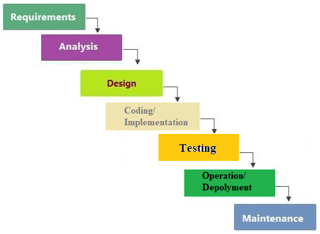

# Waterfall model

**Contents**

1.Introduction

2.Waterfall Model

3.When to use SDLC Waterfall Model?

4.Advantages of the waterfall model

5.Disadvantages of the waterfall model

6.References

# 1.Introduction

-   Winston Royce introduced the Waterfall Model in 1970.
-   The waterfall model is a linear, sequential approach to the software development life cycle ([SDLC](https://www.techtarget.com/searchsoftwarequality/definition/systems-development-life-cycle)) that is popular in [software engineering](https://www.techtarget.com/whatis/definition/software-engineering) and [product development](https://www.techtarget.com/searchcio/definition/product-development-or-new-product-development-NPD).
-   This model is the most commonly used SDLC model.
-   The developer must complete every phase before the next phase begins.
-   This model is named "**Waterfall Model**", because its diagrammatic representation resembles a cascade of waterfalls.

# 2.Waterfall Model

-   The waterfall model is composed of seven non-overlapping stages:

**1.Requirements Stage:**

-   Potential requirements, deadlines and guidelines for the project are analyzed and placed into a [functional specification](https://www.techtarget.com/searchsoftwarequality/definition/functional-specification).
-   This stage handles the defining and planning of the project without mentioning specific processes.

**2.Analysis Stage:**

-   The system specifications are analyzed to generate product models and [business logic](https://www.techtarget.com/whatis/definition/business-logic) that will guide production.
-   This is also when financial and technical resources are audited for feasibility.

**3.Design stage:**

-   A design specification document is created to outline technical design requirements such as programming language, [hardware](https://www.techtarget.com/searchnetworking/definition/hardware), data sources, architecture and services.

**4.Coding/Implementation Stage:**

-   The [source code](https://www.techtarget.com/searchapparchitecture/definition/source-code) is developed using the models, logic and requirements designated in the prior stages.
-   Typically, the system is designed in smaller components, or units, before being implemented together.

**5.Testing Stage:**

-   This is when [quality assurance](https://www.techtarget.com/searchsoftwarequality/definition/quality-assurance), [unit](https://www.techtarget.com/searchsoftwarequality/definition/unit-testing), [system](https://www.techtarget.com/searchsoftwarequality/definition/system-testing) and beta tests take place to report issues that may need to be resolved.
-   This may cause a forced repeat of the coding stage for [debugging](https://www.techtarget.com/searchsoftwarequality/definition/debugging). If the system passes the tests, the waterfall continues forward.

**6.Operation/Deployment Stage:**

-   The product or application is deemed fully functional and is deployed to a live environment.

**7.Maintenance Stage:**

-   Corrective, adaptive and perfective maintenance is carried out indefinitely to improve, update and enhance the final product.
-   This could include releasing [patch](https://www.techtarget.com/searchenterprisedesktop/definition/patch) updates or releasing new versions.
-   Before moving to the next phase, there is usually a review and sign off process to ensure that all defined goals have been met.

# 3.When to use SDLC Waterfall Model?

Some Circumstances where the use of the Waterfall model is most suited are:

-   When the requirements are constant and not changed regularly.
-   A project is short
-   The situation is calm
-   Where the tools and technology used is consistent and is not changing
-   When resources are well prepared and are available to use.

# 4.Advantages of the waterfall model

-   Forces structured, disciplined organization.
-   Is simple to understand, follow and arrange tasks.
-   Clearly defines milestones and deadlines.

# 5.Disadvantages of the waterfall model

The disadvantages of the waterfall model typically surround risk associated with a lack of revision, including:

-   Design is not adaptive; often when a flaw is found, the entire process needs to start over.
-   Ignores the potential to receive mid-process user or [client](https://www.techtarget.com/searchenterprisedesktop/definition/client) feedback and make changes based on results.
-   Delays testing until the end of the development life cycle.
-   Does not consider [error correction](https://www.techtarget.com/searchnetworking/definition/ECC).
-   Does not handle requests for changes, [scope](https://www.techtarget.com/searchcio/definition/project-scope) adjustments or updates well.
-   Reduces efficiency by not allowing processes to overlap.
-   No working product is available until the later stages of the life cycle.
-   Not ideal for complex, high risk, ongoing or [object](https://www.techtarget.com/searchapparchitecture/definition/object)-oriented projects.

# 6.References

https://www.techtarget.com/searchsoftwarequality/definition/waterfall-model
