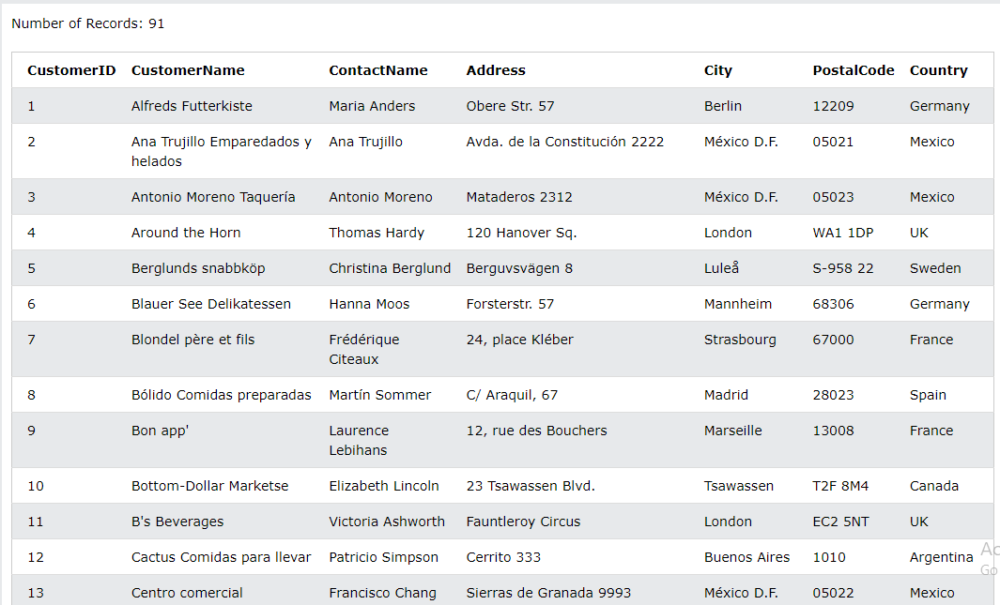

## SQL

**Content**

**1. What is SQL?**

1.1 What Can SQL do?

1.2 SQL is a Standard - BUT....

1.3 Using SQL in Your Web Site

**2. RDBMS**

**3. References**

## 1. What is SQL?

-   SQL stands for Structured Query Language
-   SQL is a standard language for accessing and manipulating databases.
-   SQL became a standard of the American National Standards Institute (ANSI) in 1986, and of the International Organization for Standardization (ISO) in 1987.

## 1.1 What Can SQL do?

-   SQL can execute queries against a database
-   SQL can retrieve data from a database
-   SQL can insert records in a database
-   SQL can update records in a database
-   SQL can delete records from a database
-   SQL can create new databases
-   SQL can create new tables in a database
-   SQL can create stored procedures in a database
-   SQL can create views in a database
-   SQL can set permissions on tables, procedures, and views

## 1.2 SQL is a Standard - BUT....

Although SQL is an ANSI/ISO standard, there are different versions of the SQL language.

However, to be compliant with the ANSI standard, they all support at least the major commands (such as SELECT, UPDATE, DELETE, INSERT, WHERE) in a similar manner.

**Note:** Most of the SQL database programs also have their own proprietary extensions in addition to the SQL standard!

## 1.3 Using SQL in Your Web Site

To build a web site that shows data from a database, you will need:

-   An RDBMS database program (i.e. MS Access, SQL Server, MySQL)
-   To use a server-side scripting language, like PHP or ASP
-   To use SQL to get the data you want
-   To use HTML / CSS to style the page

## 2. RDBMS

-   RDBMS stands for Relational Database Management System.
-   RDBMS is the basis for SQL, and for all modern database systems such as MS SQL Server, IBM DB2, Oracle, MySQL, and Microsoft Access.
-   The data in RDBMS is stored in database objects called tables. A table is a collection of related data entries and it consists of columns and rows.

**Example**

SELECT \* FROM Customers;

-   Every table is broken up into smaller entities called fields.
-   The fields in the Customers table consist of **CustomerID, CustomerName, ContactName, Address, City, PostalCode** and **Country.**
-   A field is a column in a table that is designed to maintain specific information about every record in the table.
-   A record, also called a row, is each individual entry that exists in a table. For example, there are 91 records in the above Customers table. A record is a horizontal entity in a table.
-   A column is a vertical entity in a table that contains all information associated with a specific field in a table.

## 3. References

1.  https://www.w3schools.com/sql/sql_intro.asp
