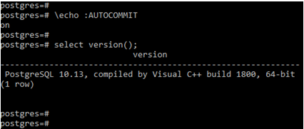
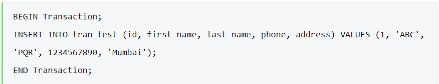
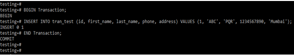
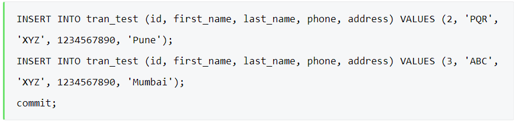
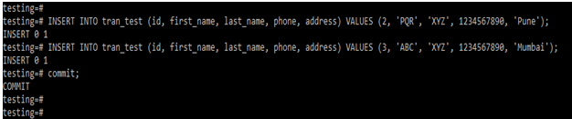
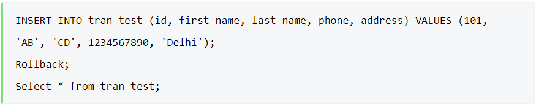
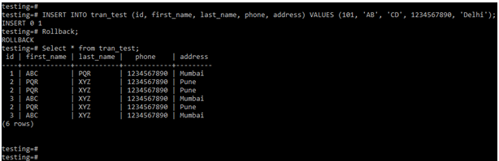

## Transaction Control Languages

**Contents**

**1. Transaction Control Languages**

**2. How does Transaction work in PostgreSQL?**

**3. PostgreSQL Transaction Statements**

3.1 Begin

3.2 Commit

3.3 Rollback

3.4 Savepoint

3.5 Examples

**4. References**

## 1. Transaction Control Languages

-   **TCL** stands for **Transaction Control Languages**.
-   These commands are used for maintaining consistency of the database and for the management of transactions made by the DML commands.
-   A **Transaction** is a set of SQL statements that are executed on the data stored in DBMS. Whenever any transaction is made these transactions are temporarily happen in database. So to make the changes permanent, we use **TCL** commands.
-   An **example** of a complete transaction transfers money from one bank account to another bank account or withdraws money from ATM; a complete transaction in any database consists of debiting money from one account and successfully credit it to another account.
-   PostgreSQL transaction is ACID (Atomicity, Consistency, Isolation, and Durability) compliant, transaction in PostgreSQL is fully ACID compliant. Transaction in any database consists of one or more statement which executes as per order.

## 2. How does Transaction work in PostgreSQL?

Below are the properties of transactions.

1.  Atomicity
2.  Consistency
3.  Isolation
4.  Durability
-   **Atomicity** is consists of operations that we have performed on the database that is fully completed or not completed. If the transactions are failed in the middle, then the transaction is rollback up to the last save point.
-   **Consistency** properties in PostgreSQL define as the database was properly changed its state of transactions up to the last transactions savepoint. At the time of working on transactions, consistency of transactions is more important.
-   **Isolation** in PostgreSQL is defined as enable the transaction operations to complete and operate independently. Also, the running transaction which was active on the server is transparent to each other.
-   **Durability** in PostgreSQL is defined as we need to ensure that the result of operations which was we have performed on the database consists of a failure. Durability is the most important property of transactions in PostgreSQL.
-   Transaction in PostgreSQL defines as the propagation of one or more changes which was we have performed on the database.
-   PostgreSQL database transaction is also defined as insert record on table, delete rows from a table, or updating the rows.
-   A transaction can be single updation, insertion, or deletion, or it can be multiple updation, deletion or insertion statements.
-   While we have to perform the transaction on the database, it is essential to control the transactions to ensure that transaction is successfully completed or not. Also, we need to handle the database’s error, which was occurred at the time of the transaction running.
-   We can club the number of queries in a single set, and after creating a set, we can execute it one by one in single transactions.
-   The transaction is very important and useful in every database; it is also the PostgreSQL database’s fundamental concept.
-   Begin, commit, rollback, and savepoint are the transaction control commands we have used in PostgreSQL.
-   **Begin command** in PostgreSQL is defined as the start of the transaction. We can start the transaction using begin keyword in PostgreSQL. We can also start the transaction using the begin transaction statements.
-   **Commit command** is used to save the transaction, which was we have executed on the database. We have to use the commit keyword to save the transaction in PostgreSQL.
-   We can also use the end transaction to commit the transaction which was executed on the database server.
-   **Rollback command** is used to roll back the transaction to a specific point. Rollback is an essential and useful command of transaction control in PostgreSQL.
-   **Save point** is defined as the partial rollback of a transaction, which was we have performed on the database.
-   Transaction control statement in PostgreSQL will be used with only DML (Data manipulation language) commands. DML commands are inserted, update, and delete. A transaction control command is not used with creating and dropping the database or tables.
-   Creating and dropping operations was automatically committed to the database, so there is no need to commit the transaction every time.
-   After successfully committing the transaction, we cannot rollback the same. To roll back the transaction, we need to set the auto commit off on the database.
-   In PostgreSQL default setting of the auto commit command is ON. The below example shows that the default setting of the auto commit command is as follows.

**Query:**

\\echo :AUTOCOMMIT

**Output:**

## 3. PostgreSQL Transaction Statements

Below is the transaction statements which was used in PostgreSQL.

-   Begin
-   Commit
-   Rollback
-   Savepoint

## 3.1 Begin

-   Begin statement is a transaction statement used to start a new transaction. To start a new transaction, we have using begin statements in PostgreSQL.
-   Below is the syntax of the begin statement in PostgreSQL.

**Syntax:**

**1.** Begin OR

**2.** Begin transaction OR

**3.** Begin work

-   The above syntax is the same work while using begin transaction or begins work.
-   Below is the example of a begin statement in PostgreSQL. We have inserted a statement after the beginning statement.
-   Insert statement is successfully executed before we have the beginning statement.

**Example**

**Output:**

## 3.2 Commit

-   Commit command in PostgreSQL is very important to save the transaction into the database server.
-   Below is the syntax of the commit statement in PostgreSQL.

**Syntax:**

**1**. Commit OR

**2**. Commit transaction OR

**3**. Commit work

-   The above syntax is the same work while using commit transactions or commits work.
-   Below is an example of a commit statement in PostgreSQL. We have to insert two statements into the database; after inserting, we have committed the same on the database.

**Example**

**Output:**

## 3.3 Rollback

-   Rollback is used to roll back the transaction from a specific point. Below is the syntax of the rollback statement in PostgreSQL.

**Syntax:**

**1**. Rollback OR

**2**. Rollback transaction OR

**3**. Rollback work

**Example**

-   In the above example, we have inserted the below statement into the table, and the same statement is rolledback after inserting.

**Query:**

**Output:**

## 3.4 Savepoint

-   SAVEPOINT command is used to temporarily save a transaction so that you can rollback to that point whenever required.
-   Following is savepoint command's syntax,

-   SAVEPOINT establishes a new savepoint within the current transaction.
-   A savepoint is a special mark inside a transaction that allows all commands that are executed after it was established to be rolled back, restoring the transaction state to what it was at the time of the savepoint.

**Parameters**

**savepoint_name**

-   The name to give to the new savepoint. If savepoints with the same name already exist, they will be inaccessible until newer identically-named savepoints are released.

**Notes**

-   Use ROLLBACK TO to rollback to a savepoint. Use RELEASE SAVEPOINT to destroy a savepoint, keeping the effects of commands executed after it was established.
-   Savepoints can only be established when inside a transaction block. There can be multiple savepoints defined within a transaction.

## 3.5 Examples

**1) To establish a savepoint and later undo the effects of all commands executed after it was established**

-   The above transaction will insert the values 1 and 3, but not 2.

**2) To establish and later destroy a savepoint**

-   The above transaction will insert both 3 and 4.

**3) To use a single savepoint name**

-   The above transaction shows row 3 being rolled back first, then row 2.

## 4. References

1.  https://www.educba.com/postgresql-transaction/
2.  https://www.postgresql.org/docs/current/sql-savepoint.html
