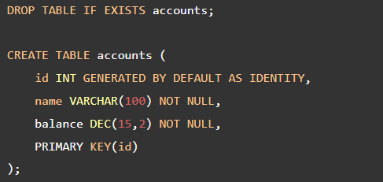

## Transaction Control Languages

**Contents**

1\. Transaction Control Languages

1.1 What is a database transaction

2\. PostgreSQL Transaction Statements

2.1 Begin a Transaction

2.2 Commit a Transaction

2.2.1 PostgreSQL COMMIT: Bank account transfer example

2.3 Rolling back a Transaction

2.4 Savepoint a Transaction

2.5 Savepoint Examples

3\. References

## 1. Transaction Control Languages

-   **TCL** stands for **Transaction Control Languages**.
-   A **Transaction** is a set of SQL statements that are executed on the data stored in DBMS. Whenever any transaction is made the transactions are temporarily happen in database. So to make the changes permanent, we use **TCL** commands.
-   TCL commands are: Begin, Commit, Rollback, Savepoint.

## 1.1 What is a database transaction

-   A database transaction is a single unit of work that consists of one or more operations.
-   A classical example of a transaction is a bank transfer from one account to another.
-   A complete transaction must ensure a balance between the sender and receiver accounts. It means that if the sender account transfers X amount, the receiver receives X amount, no more or no less.

A PostgreSQL transaction is **atomic, consistent, isolated, and durable**. These properties are often referred to as **ACID**:

-   **Atomicity** guarantees that the transaction completes in an all-or-nothing manner.
-   **Consistency** ensures the change to data written to the database must be valid and follow predefined rules.
-   **Isolation** determines how transaction integrity is visible to other transactions.
-   **Durability** makes sure that transactions that have been committed will be stored in the database permanently.

## 2. PostgreSQL Transaction Statements

Below is the transaction statements which was used in PostgreSQL.

-   Begin
-   Commit
-   Rollback
-   Savepoint

## 2.1 Begin a Transaction

-   Begin statement is a transaction statement used to start a new transaction.
-   To start a new transaction, we have using begin statements in PostgreSQL.
-   Let’s create a new table named **accounts** for the demonstration:

-   When you execute the following INSERT statement:

-   PostgreSQL inserted a new row into the accounts table immediately. In this case, you do not know when the transaction begins and cannot intercept the modification such as rolling it back.
-   To start a transaction, you use the below syntax for begin statement:

Or

or just:

-   For example, the following statements start a new transaction and insert a new account into the accounts table:

-   From the current session, you can see the change by querying the accounts table:

**Output**

## 2.2 Commit a Transaction

-   Commit command in PostgreSQL is very important to save the transaction into the database server.
-   To make the change become visible to other sessions (or users) you need to commit the transaction by using the COMMIT WORK statement:
-   Below is the syntax for the Commit statement in PostgreSQL.

Or

or simply:

-   The following COMMIT statement inserts Alice’s account to the accounts table:

-   From other sessions, you can view the change by querying the accounts table:

**Output**

-   After executing the COMMIT statement, PostgreSQL also guarantees that the change will be durable if a crash happens.
-   Put it all together.

## 2.2.1 PostgreSQL COMMIT: Bank account transfer example

-   In this demonstration, we will show you how to transfer 1000USD from Bob’s account to Alice’s account. We will use two sessions for viewing the change of each operation.
-   In the first session, start a new transaction:

-   Subtracting 1000USD from Bob’s account with id 1:

-   In the second session, check the account balance of both accounts:

**Output:**

-   As you can see, the change is not visible in other sessions.
-   Next, add the same amount (1000USD ) to Alice’s account:

-   This change also is not visible to the second session until we commit it:

-   Now, you can view the change from any session:

**Output**

-   Put it all together.

## 2.3 Rolling back a Transaction

-   To roll back or undo the change of the current transaction,
-   you use any one of the following syntax for rollback statement:

Or

or in short:

-   Suppose, you want to transfer 1500USD from Bob’s account to Alice’s account. However, you accidentally send the money to Jack’s account instead of Alice’s. And you want to roll back the whole transaction.
-   First, add Jack’s account to the accounts table:

-   Next, subtract an amount from Bob’s account:

-   Then, adding the same amount to Alice’s account:

-   However, Alice’s account has id 2. So this was a mistake.
-   To undo the change, you execute the ROLLBACK statement:

-   Finally, check the balances of all accounts:

**Output**

-   As shown clearly in the output, the account balances remain the same as they were before the transaction.
-   Put it all toegher.

## 2.4 Savepoint a Transaction

-   SAVEPOINT command is used to temporarily save a transaction so that you can rollback to that point whenever required.
-   Following is savepoint command's syntax,

-   SAVEPOINT establishes a new savepoint within the current transaction.
-   A savepoint is a special mark inside a transaction that allows all commands that are executed after it was established to be rolled back, restoring the transaction state to what it was at the time of the savepoint.

**Parameters**

**savepoint_name**

-   The name to give to the new savepoint. If savepoints with the same name already exist, they will be inaccessible until newer identically-named savepoints are released.

**Notes**

-   Use ROLLBACK TO to rollback to a savepoint. Use RELEASE SAVEPOINT to destroy a savepoint, keeping the effects of commands executed after it was established.
-   Savepoints can only be established when inside a transaction block. There can be multiple savepoints defined within a transaction.

## 2.5 Savepoint Examples

**1) To establish a savepoint and later undo the effects of all commands executed after it was established**

-   The above transaction will insert the values 1 and 3, but not 2.

**2) To establish and later destroy a savepoint**

-   The above transaction will insert both 3 and 4.

**3) To use a single savepoint name**

-   The above transaction shows row 3 being rolled back first, then row 2.

## 3. References

1.  https://www.postgresqltutorial.com/postgresql-tutorial/postgresql-transaction/
2.  https://www.postgresql.org/docs/current/sql-savepoint.html
