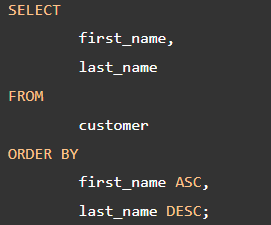
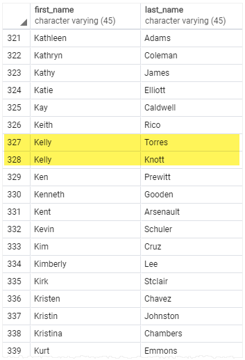
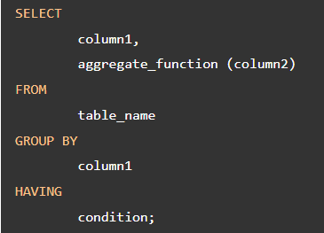

# DQL-Data Query Language

**Content**

**1. DQL (Data Query Language)**

**2. List of DQL Command**

**3. PostgreSQL SELECT and FROM Clause**

3.1 PostgreSQL SELECT and FROM Statement Syntax

3.2 PostgreSQL SELECT and FROM Examples

**4. PostgreSQL ORDER BY Clause**

4.1 PostgreSQL ORDER BY Examples

4.2 PostgreSQL ORDER BY Clause and NULL

**5. PostgreSQL WHERE Clause**

5.1 PostgreSQL WHERE Clause Examples

**6. PostgreSQL GROUP BY Clause**

6.1 PostgreSQL GROUP BY Clause Examples

**7. PostgreSQL HAVING Clause**

7.1 HAVING vs. WHERE

7.2 PostgreSQL HAVING Clause Examples

**8. References**

## 1. DQL (Data Query Language)

-   DQL or data query language is to perform the query on the data inside the schema or object (i.e table, index, view, function, etc).
-   With the help of DQL query we can get the data from the database to perform actions or operations like analysing the data.

## 2. List of DQL Command

-   **SELECT:** It is used to retrieve data from the database.

## 3. PostgreSQL SELECT and FROM Clause

-   One of the most common tasks, when you work with the database, is to query data from tables by using the SELECT statement.
-   The SELECT statement is one of the most complex statements in PostgreSQL. It has many clauses that you can use to form a flexible query.

The SELECT statement has the following clauses:

-   Sort rows using ORDER BY clause.
-   Filter rows using WHERE clause.
-   Group rows into groups using GROUP BY clause.
-   Filter groups using HAVING clause.

## 3.1 PostgreSQL SELECT and FROM Statement Syntax

-   Let’s start with the basic form of the SELECT statement that retrieves data from a single table.
-   The following illustrates the syntax of the SELECT statement:

-   **First,** specify a select list that can be a column or a list of columns in a table from which you want to retrieve data. If you specify a list of columns, you need to place a comma (,) between two columns to separate them. If you want to select **data from all the columns** of the table, you can use an asterisk (**\***) shorthand instead of specifying all the column names. The select list may also contain expressions or literal values.
-   **Second,** specify the **name of the table** from which you want to query data after the **FROM** keyword.

The FROM clause is optional. If you do not query data from any table, you can omit the FROM clause in the SELECT statement.

-   PostgreSQL evaluates the FROM clause before the SELECT clause in the SELECT statement:

## 3.2 PostgreSQL SELECT and FROM Examples

-   We will use the following **customer table** in the sample database for the demonstration.

## 1) Using PostgreSQL SELECT statement to query data from one column

-   This example uses the SELECT statement to find the first names of all customers from the customer table:

**Output**

-   **Notice** that we added a semicolon (**;**) at the **end** of the **SELECT statement**. The semicolon is not a part of the SQL statement. It is used to **signal** PostgreSQL the end of an SQL statement. The semicolon is also used to **separate two SQL statements**.

## 2) Using PostgreSQL SELECT statement to query data from multiple columns

-   Suppose you just want to know the first name, last name and email of customers, you can specify these column names in the SELECT clause as shown in the following query:

**Output**

## 3) Using PostgreSQL SELECT statement to query data from all columns of a table

-   The following query uses the SELECT statement to select data from all columns of the customer table:

**Output**

-   In this example, we used an asterisk (\*) in the SELECT clause, which is a shorthand for all columns. Instead of listing all columns in the SELECT clause, we just used the asterisk (\*) to save some typing.

However, **it is not a good practice** to use the asterisk (**\***) in the SELECT statement when you embed SQL statements in the application code like Python, Java, Node.js, or PHP due to the following reasons:

1.  **Database performance.** Suppose you have a table with many columns and a lot of data, the SELECT statement with the asterisk (\*) shorthand will select data from all the columns of the table, which may not be necessary to the application.
2.  **Application performance.** Retrieving unnecessary data from the database increases the traffic between the database server and application server. In consequence, your applications may be slower to respond and less scalable.

Because of these reasons, it is a good practice to explicitly specify the column names in the SELECT clause whenever possible to get only necessary data from the database.

-   And you should only use the asterisk (\*) shorthand for the ad-hoc queries that examine data from the database.

## 4) Using PostgreSQL SELECT statement with expressions

-   The following example uses the SELECT statement to return full names and emails of all customers:

**Output:**

-   In this example, we used the **concatenation operator** \|\| to concatenate the first name, space, and last name of every customer.

## 5) Using PostgreSQL SELECT statement with expressions and omits FROM clause

-   The following example uses the SELECT statement with an expression. It omits the FROM clause:

**Output**

## 4. PostgreSQL ORDER BY Clause

-   When you query data from a table, the SELECT statement returns rows in an unspecified order. To sort the rows of the result set, you use the ORDER BY clause in the SELECT statement.
-   The **ORDER BY** clause **allows** you to **sort rows** returned by a SELECT clause in **ascending or descending** order based on a sort expression.
-   The following illustrates the syntax of the ORDER BY clause:

In this syntax:

-   **First,** specify a **sort expression**, which can be a column or an expression, that you want to sort after the ORDER BY keywords. If you want to sort the result set based on multiple columns or expressions, you need to place a comma (,) between two columns or expressions to separate them.
-   **Second,** you use the **ASC** option to **sort rows in ascending order** and the **DESC** option to **sort rows in descending order**. If you omit the ASC or DESC option, the ORDER BY uses **ASC by default**.

PostgreSQL evaluates the clauses in the SELECT statement in the following order: FROM, SELECT, and ORDER BY:

-   Due to the order of evaluation, if you have a column alias in the SELECT clause, you can use it in the ORDER BY clause.

## 4.1 PostgreSQL ORDER BY Examples

-   We will use the customer table in the sample database for the demonstration.

### 

## 1) Using PostgreSQL ORDER BY clause to sort rows by one column

-   The following query uses the ORDER BY clause to sort customers by their first names in ascending order:

**Output**

-   Since the ASC option is the default, you can omit it in the ORDER BY clause like this:

## 2) Using PostgreSQL ORDER BY clause to sort rows by one column in descending order

-   The following statement selects the first name and last name from the customer table and sorts the rows by values in the last name column in descending order:

**Output**

## 3) Using PostgreSQL ORDER BY clause to sort rows by multiple columns

-   The following statement selects the first name and last name from the customer table and sorts the rows by the first name in ascending order and last name in descending order:

**Output**

-   In this example, the ORDER BY clause sorts rows by values in the first name column first. And then it sorts the sorted rows by values in the last name column.
-   As you can see clearly from the output, two customers with the same first name Kelly have the last name sorted in descending order.

## 4) Using PostgreSQL ORDER BY clause to sort rows by expressions

-   The **LENGTH()** function accepts a string and returns the length of that string.
-   The following statement selects the first names and their lengths. It sorts the rows by the lengths of the first names:

**Output**

-   Because the ORDER BY clause is evaluated after the SELECT clause, the column alias len is available and can be used in the ORDER BY clause.

## 4.2 PostgreSQL ORDER BY Clause and NULL

-   In the database world, NULL is a marker that indicates the missing data or the data is unknown at the time of recording.
-   When you sort rows that contains NULL, you can specify the order of NULL with other non-null values by using the NULLS FIRST or NULLS LAST option of the ORDER BY clause:

-   The NULLS FIRST option places NULL before other non-null values and the NULL LAST option places NULL after other non-null values.
-   Let’s create a table for the demonstration.

-   The following query returns data from the sort_demo table:

**Output**

-   In this example, the ORDER BY clause sorts values in the num column of the sort_demo table in ascending order. It places NULL after other values.
-   So if you use the ASC option, the ORDER BY clause uses the NULLS LAST option by default. Therefore, the following query returns the same result:

-   To place NULL before other non-null values, you use the NULLS FIRST option:

**Output**

-   The following statement sorts values in the num column of the sort_demo table in descending order:

**Output**

-   As you can see clearly from the output, the ORDER BY clause with the DESC option uses the NULLS FIRST by default.
-   To reverse the order, you can use the NULLS LAST option:

**Output**

## 5. PostgreSQL WHERE Clause

-   The syntax of the PostgreSQL WHERE clause is as follows:

-   The WHERE clause appears right after the FROM clause of the SELECT statement. The WHERE clause uses the condition to filter the rows returned from the SELECT clause.
-   The condition must evaluate to true, false, or unknown. It can be a boolean expression or a combination of boolean expressions using the AND and OR operators.
-   The query returns only rows that satisfy the condition in the WHERE clause. In other words, only rows that cause the condition evaluates to true will be included in the result set.
-   PostgreSQL evaluates the WHERE clause after the FROM clause and before the SELECT and ORDER BY clause:

-   If you use column aliases in the SELECT clause, you cannot use them in the WHERE clause.
-   Besides the SELECT statement, you can use the WHERE clause in the UPDATE and DELETE statement to specify rows to be updated or deleted.
-   To form the condition in the WHERE clause, you use comparison and logical operators:

## 5.1 PostgreSQL WHERE Clause Examples

-   We will use the **customer table** from the sample database for demonstration.

## 1) Using WHERE clause with the equal (=) operator

-   The following statement uses the WHERE clause customers whose first names are Jamie:

**Output**

## 2) Using WHERE clause with the AND operator

-   The following example finds customers whose first name and last name are Jamie and rice by using the AND logical operator to combine two Boolean expressions:

**Output**

## 3) Using the WHERE clause with the OR operator

-   This example finds the customers whose last name is Rodriguez or first name is Adam by using the OR operator:

**Output**

## 4) Using WHERE clause with the IN operator

-   If you want to match a string with any string in a list, you can use the IN operator.
-   For example, the following statement returns customers whose first name is Ann, or Anne, or Annie:

**Output**

## 5) Using the WHERE clause with the LIKE operator

-   To find a string that matches a specified pattern, you use the LIKE operator.
-   The following example returns all customers whose first names start with the string Ann:

**Output**

-   The **%** is called a **wildcard** that matches any string. The 'Ann%' pattern matches any string that starts with 'Ann'.

## 6) Using the WHERE clause with the BETWEEN operator

-   The following example finds customers whose first names start with the letter A and contains 3 to 5 characters by using the BETWEEN operator.
-   The BETWEEN operator returns true if a value is in a range of values.

**Output**

-   In this example, we used the LENGTH() function gets the number of characters of an input string.

## 7) Using the WHERE clause with the not equal operator (\<\>)

-   This example finds customers whose first names start with Bra and last names are not Motley:

**Output**

-   **Note that** you can use the **!=** operator and **\<\>** operator interchangeably because they are equivalent.

## 6. PostgreSQL GROUP BY Clause

-   The GROUP BY clause divides the rows returned from the SELECT statement into groups. For each group, you can apply an aggregate function e.g., SUM() to calculate the sum of items or COUNT() to get the number of items in the groups.
-   The following statement illustrates the basic syntax of the GROUP BY clause:

In this syntax:

-   **First,** select the columns that you want to group e.g., column1 and column2, and column that you want to apply an aggregate function (column3).
-   **Second**, **list the columns** that you want to **group** in the GROUP BY clause.

The statement clause divides the rows by the values of the columns specified in the GROUP BY clause and calculates a value for each group.

-   It’s possible to use other clauses of the SELECT statement with the GROUP BY clause.
-   PostgreSQL evaluates the GROUP BY clause after the FROM and WHERE clauses and before the HAVING, SELECT, DISTINCT, ORDER BY and LIMIT clauses.

## 6.1 PostgreSQL GROUP BY clause Examples

-   Let’s take a look at the **payment** table in the sample database.

## 1) Using PostgreSQL GROUP BY without an aggregate Function

-   You can use the GROUP BY clause without applying an aggregate function.
-   The following query gets data from the payment table and groups the result by customer id.

**Output**

-   In this case, the GROUP BY works like the DISTINCT clause that removes duplicate rows from the result set.

## 2) Using PostgreSQL GROUP BY with SUM() Function

-   The GROUP BY clause is useful when it is used in conjunction with an aggregate function.
-   For example, to select the total amount that each customer has been paid, you use the GROUP BY clause to divide the rows in the payment table into groups grouped by customer id. For each group, you calculate the total amounts using the SUM() function.
-   The following query uses the GROUP BY clause to get total amount that each customer has been paid:

**Output**

-   The GROUP BY clause sorts the result set by customer id and adds up the amount that belongs to the same customer. Whenever the customer_id changes, it adds the row to the returned result set.
-   The following statement uses the ORDER BY clause with GROUP BY clause to sort the groups:

**Output**

## 3) Using PostgreSQL GROUP BY clause with the JOIN Clause

-   The following statement uses the GROUP BY clause with the INNER JOIN clause the get the total amount paid by each customer.

Unlike the previous example, this query joins the payment table with the customer table and group customers by their names.

**Output**

## 4) Using PostgreSQL GROUP BY with COUNT() Function

-   To find the number of payment transactions that each staff has been processed, you group the rows in the payment table by the values in the staff_id column and use the COUNT() function to get the number of transactions

**Output**

-   The GROUP BY clause divides the rows in the payment into groups and groups them by value in the staff_id column. For each group, it returns the number of rows by using the COUNT() function.

## 5) Using PostgreSQL GROUP BY with multiple columns

-   The following example uses multiple columns in the GROUP BY clause

-   In this example, the GROUP BY clause divides the rows in the payment table by the values in the customer_id and staff_id columns. For each group of (customer_id, staff_id), the SUM() calculates the total amount.

**Output**

## 6) Using PostgreSQL GROUP BY clause with date column

-   The payment_date is a timestamp column. To group payments by dates, you use the DATE() function to convert timestamps to dates first and then group payments by the result date:

**Output**

## 7. PostgreSQL HAVING Clause

-   The HAVING clause specifies a search condition for a group or an aggregate.
-   The HAVING clause is often used with the GROUP BY clause to filter groups or aggregates based on a specified condition.
-   The following statement illustrates the basic syntax of the HAVINGclause:

-   In this syntax, the group by clause returns rows grouped by the column1. The HAVING clause specifies a condition to filter the groups.
-   It’s possible to add other clauses of the SELECT statement such as JOIN, LIMIT, FETCH etc.
-   PostgreSQL evaluates the HAVING clause after the FROM, WHERE, GROUP BY, and before the SELECT, DISTINCT, ORDER BY and LIMIT clauses.

-   Since the HAVING clause is evaluated before the SELECT clause, you cannot use column aliases in the HAVING clause. Because at the time of evaluating the HAVING clause, the column aliases specified in the SELECT clause are not available.

## 7.1 HAVING vs. WHERE

-   The WHERE clause allows you to filter rows based on a specified condition. However, the HAVING clause allows you to filter groups of rows according to a specified condition.
-   In other words, the WHERE clause is applied to rows while the HAVING clause is applied to groups of rows.

## 7.2 PostgreSQL HAVING Clause Examples

-   Let’s take a look at the **payment** table in the sample database.

## 1) Using PostgreSQL HAVING clause with SUM function example

-   The following query uses the GROUP BY clause with the SUM() function to find the total amount of each customer:

**Output**

-   The following statement adds the HAVING clause to select the only customers who have been spending more than 200:

**Output**

## 2) PostgreSQL HAVING clause with COUNT example

-   See the following **customer** table from the sample database:

-   The following query uses the GROUP BY clause to find the number of customers per store:

**Output**

-   The following statement adds the HAVING clause to select the store that has more than 300 customers:

**Output**

## 8. References

1.  https://www.postgresqltutorial.com/postgresql-tutorial/postgresql-select/
2.  https://www.postgresqltutorial.com/postgresql-tutorial/postgresql-order-by/
3.  https://www.postgresqltutorial.com/postgresql-tutorial/postgresql-where/
4.  https://www.postgresqltutorial.com/postgresql-tutorial/postgresql-group-by/
5.  https://www.postgresqltutorial.com/postgresql-tutorial/postgresql-having/
