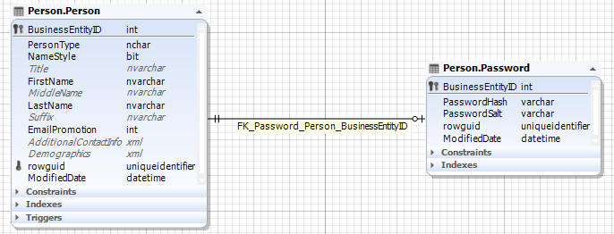

**Note:**

-   This document uses **SQL Server** as a database server. The queries used follows SQL Server syntax.

# Multiplicity

**Content**

**1. What is a relation in a database?**

**2. Types of Relationships in a Database**

**2.1 One-to-Many relationship**

2.1.1 Example of one-to-many relation in SQL Server

**2.2 One-to-one relationship**

2.2.1 Example of one-to-one relation in SQL Server

**2.3 Many-to-many relationship**

2.3.1 Example of many-to-many relation in SQL Server

**2.4 Many-to-one relationship**

**3. References**

## 1. What is a relation in a database?

Let’s start with some basic terminology.

-   The term **relation** is sometimes used to refer to a table in a relational database. However, it is more often used to describe the relationships that exist between the tables in a relational database.
-   A **relationship** between two database tables presupposes that one of them has a foreign key that references the primary key of another table.
-   **Database entity**—strictly speaking — is a person, place, thing, object, or any item about which data is stored in the database. However, the term is usually used to refer to the database table as tables are, in fact, the physical implementation of entities.
-   An **entity-relationship diagram**, also known as ERD, ER diagram, or ER model, comprises a graphical representation of how entities relate to each other within a database.
-   ER models are widely used in database design as they are fairly abstract and are easy to view and analyze.
-   Let’s have a look at the entity-relationship diagram of the BicycleStore database with the help of the Database Diagram tool that comes with dbForge Studio for SQL Server.

## 2. Types of Relationships in a Database

There are 3 main types of relationship in a database:

-   one-to-one
-   one-to-many / many-to-one
-   many-to-many.

-   However, you may also encounter references to a many-to-one relationship which, in fact, is a special case of a one-to-many relationship and self-referencing relationship which occurs when only one table is involved.
-   Let’s examine each relationship type in detail and consider the peculiarities of creating relationships in SQL.

## 2.1 One-to-Many relationship

-   Let’s start with a one-to-many relationship as it is the most commonly used type.

**what is one-to-many relationship in SQL?**

-   A one-to-many relationship occurs when one record in table 1 is related to one or more records in table 2.
-   However, one record in table 2 cannot be related to more than one record in table 1.
-   We can come up with hundreds of examples of such relations: pages and the book they belong to, pupils and their class, orders and the customer who placed them, etc.

**How to join tables with one-to-many relationship in SQL?**

-   INNER JOINs are considered to be the most effective way to combine data from two tables that have one-to-many relationship.
-   Let’s query two SQL tables having one-to-many relationship.

## 2.1.1 Example of one-to-many relation in SQL Server

How to implement one-to-many relationships when designing a database:

1.  Create two tables (table 1 and table 2) with their own primary keys.
2.  Add a foreign key on a column in table 1 based on the primary key of table 2. This will mean that table 1 can have one or more records related to a single record in table 2.

**Step 1**

**Step 2**

## 2.2 One-to-one relationship

-   A one-to-one relationship in a database occurs when each row in table 1 has only one related row in table 2.
-   For example, a department may have only one head manager, a husband — only one wife, an employee — one company car, etc.
-   One-to-one relationship example in SQL:

## 2.2.1 Example of one-to-one relation in SQL Server

**How to create one-to-one relationship in SQL Server?**

-   For this, you will need to create two tables, then define a simple primary foreign key relationship between them, and set the foreign key column to be unique.

## 2.3 Many-to-many relationship

-   A many-to-many relationship occurs when multiple records in one table are related to multiple records in another table.
-   For example, products and suppliers: one supplier may deliver one or many products and at the same time, the company may order one product from one or many suppliers.
-   A many-to-many relationship example in SQL:

-   The relationship between the Product entity and Order entity is many-to-many, as one product may be in many orders and many orders may contain the same product.

## 2.3.1 Example of many-to-many relation in SQL Server

-   Relational databases don’t support direct many-to-many relationships between two tables.

**How to implement many-to-many relationships in SQL?**

-   To create a many-to-many relationship in a database, you’ll need to create a third table to connect the other two. This new table (also known as a *linking*, *joining*, *bridging*, or *junction* table) will contain the primary key columns of the two tables you want to relate and will serve as an intermediate table between them.
-   Suppose, we want to establish a many-to-many relationship between two tables: *films* and *category*. First, we create the two tables.

-   Next, we create a junction table *film_category* that will map these two tables together by referencing the primary keys of both tables.

-   A many-to-many relationship between the films and category tables has been successfully established.

## 2.4 Many-to-one relationship

-   Many experts don’t separate a many-to-one relationship as a class of its own as there is not much difference between one-to-many and many-to-one relationships.
-   It’s just a matter of focus. For example, if one school class can consist of several pupils then, class to pupil is a one-to-many relationship (one class consists of many pupils), while pupil to class relationship is many-to-one (many pupils study in one class).
-   Example of many-to-one relationship in SQL:

## 3. References

1.  https://blog.devart.com/types-of-relationships-in-sql-server-database.html
