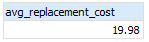
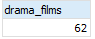

# Aggregate and Scalar Functions

**Content**

1\. PostgreSQL aggregate functions

1.1 PostgreSQL aggregate functions examples

2\. Scalar Functions

2.1 Scalar Functions Examples

3\. References

## 1. PostgreSQL Aggregate Functions

-   Aggregate functions perform a calculation on a set of rows and return a single row.
-   PostgreSQL provides all standard SQL’s aggregate functions as follows:
1.  AVG() – return the average value.
2.  COUNT() – return the number of values.
3.  MAX() – return the maximum value.
4.  MIN() – return the minimum value.
5.  SUM() – return the sum of all or distinct values.
-   We often use the aggregate functions with the GROUP BY clause in the SELECT statement.
-   In these cases, the GROUP BY clause divides the result set into groups of rows and the aggregate functions perform a calculation on each group e.g., maximum, minimum, average, etc.
-   You can use aggregate functions as expressions only in the following clauses:
1.  SELECT clause.
2.  HAVING clause.

## 1.1 PostgreSQL aggregate functions examples

-   Let’s use the **film** table in the **sample database** for the demonstration.

## 1) AVG() Function

-   The following statement uses the AVG() function to calculate the average replacement cost of all films:

**Output**

-   **Noted that** the ROUND() function was used to round the result to 2 decimal places.
-   To calculate the average replacement cost of the **Drama films** whose category id is 7, you use the following statement:

**Output**

## 2) COUNT() Function

-   To get the number of films, you use the COUNT(\*) function as follows:

**Output**

-   To get the number of drama films, you use the following statement:

-   The result showed that we have 62 drama films:

## 3) MAX() Function

-   The following statement returns the maximum replacement cost of films.

**Output**

-   To get the films that have the maximum replacement cost, you use the following query:

**Output**

-   The subquery returned the maximum replacement cost which then was used by the outer query for retrieving the film’s information.

## 4) MIN() Function

-   The following example uses the MIN() function to return the minimum replacement cost of films:

**Output**

-   To get the films which have the minimum replacement cost, you use the following query:

**Output**

## 5) SUM() Function

-   The following statement uses the SUM() function to calculate the total length of films grouped by film’s rating:

**Output**

## 2. Scalar Functions

These functions are based on user input, these returns single value.

1.  UCASE()
2.  LCASE()
3.  MID()
4.  LEN()
5.  ROUND()
6.  NOW()
7.  FORMAT()

## 2.1 Scalar Functions Examples

**1) UCASE()**: It converts the value of a field to uppercase.

**Syntax:**

SELECT UCASE(column_name) FROM table_name;

**Queries:**

-   Converting names of students from the table Students to uppercase.

SELECT UCASE(NAME) FROM Students;

**Output:**

| **NAME** |
|----------|
| HARSH    |
| SURESH   |
| PRATIK   |
| DHANRAJ  |
| RAM      |

**2) LCASE()**: It converts the value of a field to lowercase.

**Syntax:**

SELECT LCASE(column_name) FROM table_name;

**Queries:**

-   Converting names of students from the table Students to lowercase.

SELECT LCASE(NAME) FROM Students;

**Output:**

| **NAME** |
|----------|
| harsh    |
| suresh   |
| pratik   |
| dhanraj  |
| ram      |

**3) MID():** The MID() function extracts texts from the text field.

**Syntax:**

SELECT MID(column_name,start,length) AS some_name FROM table_name;

specifying length is optional here, and start signifies start position ( starting from 1 )

**Queries:**

-   Fetching first four characters of names of students from the Students table.

SELECT MID(NAME,1,4) FROM Students;

**Output:**

| **NAME** |
|----------|
| HARS     |
| SURE     |
| PRAT     |
| DHAN     |
| RAM      |

**4) LEN():** The LEN() function returns the length of the value in a text field.

**Syntax:**

SELECT LENGTH(column_name) FROM table_name;

**Queries:**

-   Fetching length of names of students from Students table.

SELECT LENGTH(NAME) FROM Students;

**Output:**

| **NAME** |
|----------|
| 5        |
| 6        |
| 6        |
| 7        |
| 3        |

**5) ROUND():** The ROUND() function is used to round a numeric field to the number of decimals specified.

-   **NOTE:** Many database systems have adopted the IEEE 754 standard for arithmetic operations, which says that when any numeric .5 is rounded it results to the nearest even integer i.e, 5.5 and 6.5 both gets rounded off to 6.

**Syntax:**

SELECT ROUND(column_name,decimals) FROM table_name;

decimals- number of decimals to be fetched.

**Queries:**

-   Fetching maximum marks among students from the Students table.

SELECT ROUND(MARKS,0) FROM table_name;

**Output:**

| **MARKS** |
|-----------|
| 90        |
| 50        |
| 80        |
| 95        |
| 85        |

**6) NOW():** The NOW() function returns the current system date and time.

**Syntax:**

SELECT NOW() FROM table_name;

**Queries:**

-   Fetching current system time.

SELECT NAME, NOW() AS DateTime FROM Students;

**Output:**

| **NAME** | **DateTime**         |
|----------|----------------------|
| HARSH    | 1/13/2017 1:30:11 PM |
| SURESH   | 1/13/2017 1:30:11 PM |
| PRATIK   | 1/13/2017 1:30:11 PM |
| DHANRAJ  | 1/13/2017 1:30:11 PM |
| RAM      | 1/13/2017 1:30:11 PM |

**7) FORMAT():** The FORMAT() function is used to format how a field is to be displayed.

**Syntax:**

SELECT FORMAT(column_name,format) FROM table_name;

**Queries:**

-   Formatting current date as ‘YYYY-MM-DD’.

SELECT NAME, FORMAT(Now(),'YYYY-MM-DD') AS Date FROM Students;

**Output:**

| **NAME** | **Date**   |
|----------|------------|
| HARSH    | 2017-01-13 |
| SURESH   | 2017-01-13 |
| PRATIK   | 2017-01-13 |
| DHANRAJ  | 2017-01-13 |
| RAM      | 2017-01-13 |

## 3. References

1.  <https://www.postgresqltutorial.com/postgresql-aggregate-functions/>
2.  https://www.geeksforgeeks.org/sql-functions-aggregate-scalar-functions/
