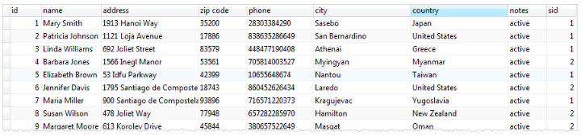
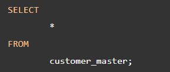

# VIEWS

**Content**

1\. PostgreSQL Views

2\. Creating PostgreSQL Views

2.1 PostgreSQL View with Select Statement Example

3\. Changing PostgreSQL Views

4\. Removing PostgreSQL Views

5\. References

## 1. PostgreSQL Views

-   A view is a database object that is of a stored query.
-   A view can be accessed as a virtual table in PostgreSQL. In other words, a PostgreSQL view is a logical table that represents data of one or more underlying tables through a SELECT statement.
-   Notice that a view does not store data physically except for a materialized view.

A view can be very useful in some cases such as:

-   A view helps simplify the complexity of a query because you can query a view, which is based on a complex query, using a simple SELECT statement.
-   Like a table, you can grant permission to users through a view that contains specific data that the users are authorized to see.
-   A view provides a consistent layer even the columns of underlying table changes.

## 2. Creating PostgreSQL Views

-   To create a view, we use CREATE VIEW statement.
-   The simplest syntax of the CREATE VIEW statement is as follows:

-   **First,** you specify the **name** of the **view** after the CREATE VIEW clause, then you put a **query after the AS** keyword.
-   A query can be a simple SELECT statement or a complex SELECT statement with joins.

## 2.1 PostgreSQL View with Select Statement Example

For example, in our sample database, we have four tables:

1.  customer – stores all customer data
2.  address – stores address of customers
3.  city – stores city data
4.  country– stores country data

-   If you want to get a complete customers data, you normally construct a join statement as follows:

-   The result of the query is as shown in the screenshot below:

-   This query is quite complex. However, you can create a view named customer_master as follows:

-   From now on, whenever you need to get a complete customer data, you just query it from the view by executing the following simple SELECT statement:

-   This query produces the same result as the complex one with joins above.

## 3. Changing PostgreSQL Views

-   To change the defining query of a view, you use the CREATE VIEW statement with OR REPLACE addition as follows:

-   PostgreSQL does not support removing an existing column in the view, at least up to version 9.4.
-   If you try to do it, you will get an error message:

    “[Err] ERROR: cannot drop columns from view”.

-   The query must generate the same columns that were generated when the view was created.
-   To be more specific, the new columns must have the same names, same data types, and in the same order as they were created.
-   However, PostgreSQL allows you to append additional columns at the end of the column list.

For example, you can add an email to the customer_master view as follows:

-   Now, if you select data from the customer_master view, you will see the email column at the end of the list.

-   To change the definition of a view, you use the ALTER VIEW statement.
-   For example, you can change the name of the view from customer_master to customer_info by using the following statement:

## 4. Removing PostgreSQL Views

-   To remove an existing view in PostgreSQL, you use DROP VIEW statement as follows:

-   You specify the name of the view that you want to remove after DROP VIEW clause.
-   Removing a view that does not exist in the database will result in an error. To avoid this, you normally add IF EXISTS option to the statement to instruct PostgreSQL to remove the view if it exists, otherwise, do nothing.
-   For example, to remove the customer_info view that you have created, you execute the following query:

-   The view customer_info is removed from the database.

## 5. References

1.  https://www.postgresqltutorial.com/postgresql-views/
2.  https://www.postgresqltutorial.com/postgresql-views/managing-postgresql-views/
