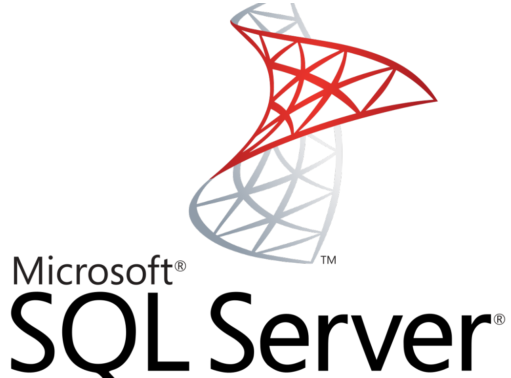
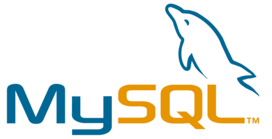
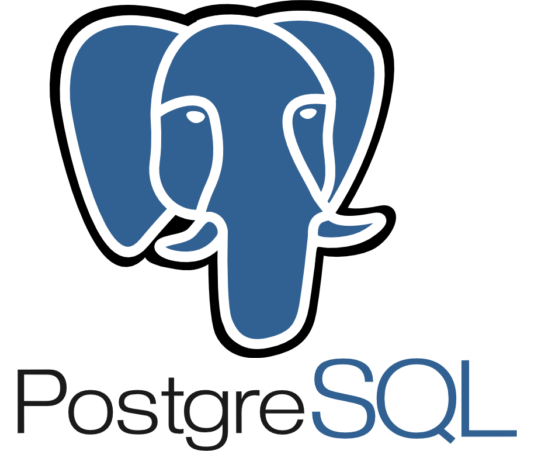
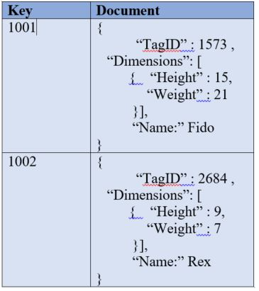
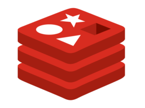

## Relational vs Non-Relational Databases

**Content**

**1. Relational Databases**

1.1 Popular Relational/SQL Databases

1.1.1 SQL Server

1.1.2 MySQL

1.1.3 PostgreSQL

**2. Non-Relational Databases**

2.1 Popular Non-Relational/NoSQL Databases

2.1.1 MongoDB

2.1.2 Redis

**3. Relational vs Non-Relational Databases**

**4. Referneces**

## 1. Relational Databases

-   A relational database is one that stores data in tables.
-   The relationship between each data point is clear and searching through those relationships is relatively easy.
-   The relationship between tables and field types is called a **schema**.
-   For relational databases, the schema must be clearly defined. Let’s look at an example:

-   Here we see three tables all providing unique information on a specific dog.
-   A relational database user can then obtain a view of the database to fit their needs.
-   For example, I might want to view or report on all dogs over 100 pounds. Or you may wish to see which breeds eat dry food. Relational databases make answering questions like these relatively easy.
-   Relational databases are also called **SQL databases**.
-   SQL stands for Structured Query Language and it’s the language relational databases are written in. SQL is used to execute queries, retrieve data, and edit data by updating, deleting, or creating new records.

## 1.1 Popular Relational/SQL Databases

## 1.1.1 SQL Server

-   SQL Server is a relational database management system developed Microsoft.
-   They offer multiple editions with varying features to target different users.

## 1.1.2 MySQL

-   First released in 1995, MySQL is a free and open-source software, and one of the most popular databases in the world.
-   It is used by many high-traffic websites like Facebook and YouTube.

## 1.1.3 PostgreSQL

-   Where MySQL is based on the relational model, PostgreSQL is based on the object-relational model.
-   Another free and open-source database, PostgreSQL was released in 1996 with an emphasis on extensibility.
-   It’s able to handle complicated data workloads due to its diversified extension functions.

## 2. Non-Relational Databases

-   A **non-relational database** is any database that does not use the tabular schema of rows and columns like in relational databases. Rather, its storage model is optimized for the type of data it’s storing.

-   Non-relational databases are also known as **NoSQL databases** which stands for “Not Only SQL.”
-   Where relational databases only use SQL, non-relational databases can use other types of query language.

## 2.1 Popular Non-Relational/NoSQL Databases

## 2.1.1 MongoDB

-   MongoDB is a document store and currently the most popular NoSQL database engine in use.
-   It uses JSON-like documents to store data and is run over multiple servers.
-   MongoDB allows for auto-sharding which is a type of database partitioning that separates very large databases into smaller, faster, more easily managed parts called data shards.

## 2.1.2 Redis

-   Redis – Remote Dictionary Server – is a key-value store.
-   It supports different kinds of abstract data structures such as strings, lists, maps, sets, sorted sets, and more. It’s also open-source.

## 3. Relational vs Non-Relational Databases

-   To summarize the difference between the relational and non-relational databases: **relational databases store data in rows and columns like a spreadsheet while non-relational databases store data don’t, using a storage model that is best suited for the type of data it’s storing.**

## 4. Referneces

1.  https://insightsoftware.com/blog/whats-the-difference-relational-vs-non-relational-databases/\#:\~:text=To%20summarize%20the%20difference%20between,type%20of%20data%20it's%20storing.
