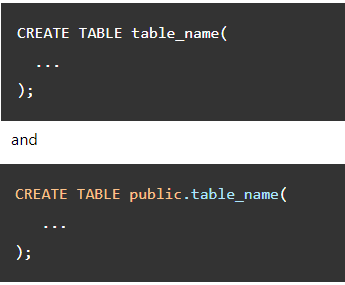

## PostgreSQL schema

**Content**

**1. What is a PostgreSQL schema**

1.1 Why do you need to use schemas

1.2 The public schema

1.3 PostgreSQL schema operations

**2. References**

## 1. What is a PostgreSQL schema

-   In PostgreSQL, a schema is a namespace that contains named database objects such as tables, views, indexes, data types, functions, stored procedures and operators.
-   To access an object in a schema, you need to qualify the object by using the following syntax:

-   A database can contain one or multiple schemas and each schema belongs to only one database. Two schemas can have different objects that share the same name.
-   For example, you may have sales schema that has staff table and the public schema which also has the staff table. When you refer to the staff table you must qualify it as follows:

## 1.1 Why do you need to use schemas

There are some scenarios that you want to use schemas:

-   Schemas allow you to organize database objects e.g., tables into logical groups to make them more manageable.
-   Schemas enable multiple users to use one database without interfering with each other.

## 1.2 The public schema

-   PostgreSQL automatically creates a schema called public for every new database.
-   Whatever object you create without specifying the schema name, PostgreSQL will place it into this public schema. Therefore, the following statements are equivalent:

## 1.3 PostgreSQL schema operations

-   To create a new schema, you use the **CREATE SCHEMA** statement.
-   To rename a schema or change its owner, you use the **ALTER SCHEMA** statement.
-   To drop a schema, you use the **DROP SCHEMA** statement.

## 2. References

https://www.postgresqltutorial.com/postgresql-administration/postgresql-schema/
