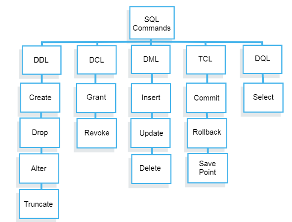

## SQL Data Types and Categories

**Content**

**1. SQL Data Types**

1.1 Boolean

1.2 Character

1.2.1 CHAR(n)

1.2.2 VARCHAR(n)

1.2.3 TEXT

1.3 Numeric

1.3.1 Integer

1.3.2 Floating-point number

1.4 Temporal data types

**2. SQL Commands**

**3. Categories of SQL**

3.1 Defining Database Structures

3.2 Manipulating Data

3.3 Selecting Data

3.4 Data Control Language

3.5 Transactional Control Commands

**4. References**

## 1. SQL Data Types

SQL supports the following data types:

-   **Boolean**
-   **Character** types such as char, varchar, and text.
-   **Numeric** types such as integer and floating-point number.
-   **Temporal** types such as date, time, timestamp, and interval
-   **UUID** for storing Universally Unique Identifiers
-   **Array** for storing array strings, numbers, etc.
-   **JSON** stores JSON data
-   **hstore** stores key-value pair
-   **Special types** such as network address and geometric data.

## 1.1 Boolean

-   A Boolean data type can hold one of three possible values: true, false or null.
-   You use **boolean or bool** keyword to declare a column with the Boolean data type.
-   When you insert data into a Boolean column, PostgreSQL converts it to a Boolean value
1.  **1**, yes, y, t, true values are converted to true
2.  **0**, no, false, f values are converted to false.
-   When you select data from a Boolean column, PostgreSQL converts the values back e.g., t to true, f to false and space to null.

## 1.2 Character

-   PostgreSQL provides three character data types: **CHAR(n), VARCHAR(n), and TEXT**

## 1.2.1 CHAR(n)

-   **CHAR(n)** is the fixed-length character with space padded.
-   If you insert a string that is shorter than the length of the column, PostgreSQL pads spaces.
-   If you insert a string that is longer than the length of the column, PostgreSQL will issue an error.

## 1.2.2 VARCHAR(n)

-   **VARCHAR(n)** is the variable-length character string.
-   With VARCHAR(n), you can store up to n characters.
-   PostgreSQL does not pad spaces when the stored string is shorter than the length of the column.

## 1.2.3 TEXT

-   **TEXT** is the variable-length character string.
-   Theoretically, text data is a character string with unlimited length.

## 1.3 Numeric

PostgreSQL provides two distinct types of numbers:

-   integers
-   floating-point numbers

## 1.3.1 Integer

There are three kinds of integers in PostgreSQL:

-   **Small integer** ( SMALLINT) is 2-byte signed integer that has a range from -32,768 to 32,767.
-   **Integer** ( INT) is a 4-byte integer that has a range from -2,147,483,648 to 2,147,483,647.
-   **Serial** is the same as integer except that PostgreSQL will automatically generate and populate values into the SERIAL column. This is similar to AUTO_INCREMENT column in MySQL or AUTOINCREMENT column in SQLite.

## 1.3.2 Floating-point number

There three main types of floating-point numbers:

-   **float(n)** is a floating-point number whose precision, at least, n, up to a maximum of 8 bytes.
-   **real or float8** is a 4-byte floating-point number.
-   **numeric or numeric(p,s)** is a real number with p digits with s number after the decimal point. The numeric(p,s) is the exact number.

## 1.4 Temporal data types

-   The temporal data types allow you to store date and /or time data.
-   PostgreSQL has five main temporal data types:
1.  **DATE** stores the dates only.
2.  **TIME** stores the time of day values.
3.  **TIMESTAMP** stores both date and time values.
4.  **TIMESTAMPTZ** is a timezone-aware timestamp data type. It is the abbreviation for timestamp with the time zone.
5.  **INTERVAL** stores periods of time.

The TIMESTAMPTZ is the PostgreSQL’s extension to the SQL standard’s temporal data types.

## 2. SQL Commands

-   SQL commands are instructions. It is used to communicate with the database. It is also used to perform specific tasks, functions, and queries of data.
-   SQL can perform various tasks like create a table, add data to tables, drop the table, modify the table, set permission for users.

## 3. Categories of SQL

Five Categories of widely used SQL queries.

-   Data Definition Language (DDL)
-   Data Manipulation Language (DML)
-   Data Control Language(DCL)
-   Transaction Control Language(TCL)
-   Data Query Language (DQL)

****

## 3.1 Defining Database Structures

-   **Data Definition Language, DDL,** changes the structure of the table like creating a table, deleting a table, altering a table, etc.
-   All the command of DDL are auto-committed that means it permanently save all the changes in the database.

Some of the most fundamental DDL commands

-   CREATE TABLE
-   ALTER TABLE
-   DROP TABLE
-   CREATE INDEX
-   ALTER INDEX
-   DROP INDEX
-   CREATE VIEW
-   DROP VIEW

## 3.2 Manipulating Data

-   DML commands are used to modify the database. It is responsible for all form of changes in the database.
-   The command of DML is not auto-committed that means it can't permanently save all the changes in the database. They can be rollback.

There are three basic DML commands:

-   INSERT
-   UPDATE
-   DELETE

## 3.3 Selecting Data

-   **Data Query Language, DQL,** is used to fetch the data from the database.
-   It uses only one command:

    SELECT

-   This command, accompanied by many options and clauses, is used to compose queries against a relational database. Queries, from simple to complex, from vague to specific, can be easily created.
-   A *query* is an inquiry to the database for information.
-   A query is usually issued to the database through an application interface or via a command line prompt.

## 3.4 Data Control Language

-   Data control commands in SQL allow you to control access to data within the database.
-   These DCL commands are normally used to create objects related to user access and also control the distribution of privileges among users.
-   DCL commands are used to grant and take back authority from any database user.

Some data control commands are as follows:

-   ALTER PASSWORD
-   GRANT
-   REVOKE

## 3.5 Transactional Control Commands

-   TCL commands are automatically committed in the database that's why they cannot be used while creating tables or dropping them.

In addition to the previously introduced categories of commands, there are commands that allow the user to manage database transactions.

-   COMMIT Saves database transactions
-   ROLLBACK Undoes database transactions
-   SAVEPOINT Creates points within groups of transactions in which to ROLLBACK

## 4. References

1.  https://www.informit.com/articles/article.aspx?p=29583&seqNum=3
2.  https://www.postgresqltutorial.com/postgresql-tutorial/postgresql-data-types/
