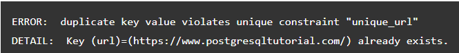
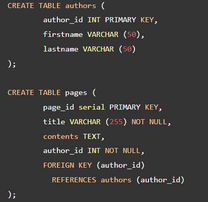
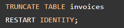

## DDL (Data Definition Language)

**Content**

**1. DDL (Data Definition Language)**

**2. DDL Commands**

**2.1 PostgreSQL CREATE TABLE**

2.1.1 PostgreSQL CREATE TABLE examples

**2.2 PostgreSQL ALTER TABLE statement**

2.2.1 PostgreSQL ALTER TABLE examples

**2.3 PostgreSQL DROP TABLE**

## 1. DDL (Data Definition Language)

-   DDL or Data definition language is actually the definition or description of the database structure or schema
-   It won't change the data inside the database.
-   Create, modify, and delete the database structures, but not the data.

## 2. DDL Commands

-   **Create** − It is used to create a new table or a new database.
-   **Alter** − It is used to alter or change the structure of the database table.
-   **Drop** − It is used to delete a table, index, or views from the database.
-   **Truncate** − It is used to delete the records or data from the table, but its structure remains as it is.

# 2.1 PostgreSQL CREATE TABLE

-   A relational database consists of multiple related tables.
-   A table consists of rows and columns. Tables allow you to store structured data like customers, products, employees, etc.
-   To create a new table, you use the **CREATE TABLE** statement.
-   The following illustrates the basic syntax of the CREATE TABLE statement:

In this syntax:

-   First, specify the **name of the table** after the CREATE TABLE keywords.
-   Second, creating a table that **already exists** will result in a **error**. The IF NOT EXISTS option allows you to create the new table only if it does not exist. When you use the IF NOT EXISTS option and the table already exists, PostgreSQL issues a notice instead of the error and skips creating the new table.
-   Third, specify a **comma**-separated list of table columns. Each column consists of the column name, the kind of data that column stores, the length of data, and the column constraint. The column constraints specify rules that data stored in the column must follow. For example, the not-null constraint enforces the values in the column cannot be NULL. The column constraints include not null, unique, primary key, check, foreign key constraints.
-   Finally, specify the table constraints including primary key, foreign key, and check constraints.

**Note that** some table constraints can be defined as column constraints like primary key, foreign key, check, unique constraints.

# 2.1.1 PostgreSQL CREATE TABLE examples

Create a new table called **accounts** that has the following columns:

-   user_id – primary key
-   username – unique and not null
-   password – not null
-   email – unique and not null
-   created_on – not null
-   last_login – null

The following statement creates the accounts table:

-   The following statement creates the **roles table** that consists of two columns: **role_id** and **role_name**:

-   The following statement creates the **account_roles** **table** that has three columns: **user_id, role_id** and **grant_date**.

-   The primary key of the **account_roles table** consists of two columns: user_id and role_id, therefore, we have to define the primary key constraint as a table constraint.

-   Because the user_id column references to the user_id column in the accounts table, we need to define a foreign key constraint for the user_id column:

-   The role_id column references the role_id column in the roles table, we also need to define a foreign key constraint for the role_id column.

-   The following diagram shows the relationship between the accounts, roles, and account_roles tables:

## 2.2 PostgreSQL ALTER TABLE statement

-   To change the structure of an existing table, you use PostgreSQL ALTER TABLE statement.
-   The following illustrates the basic syntax of the ALTER TABLE statement:

PostgreSQL provides you with many actions:

-   Add a column
-   Drop a column
-   Change the data type of a column
-   Rename a column
-   Set a default value for the column.
-   Add a constraint to a column.
-   Rename a table

1) To add a **new column** to a table, you use **ALTER TABLE ADD COLUMN** statement:

2) To **drop a column** from a table, you use **ALTER TABLE DROP COLUMN** statement:

3) To **rename a column**, you use the **ALTER TABLE RENAME COLUMN TO** statement:

1.  To change a **default value** of the column, you use **ALTER TABLE ALTER COLUMN SET DEFAULT or DROP DEFAULT:**

1.  To change the **NOT NULL constraint**, you use **ALTER TABLE ALTER COLUMN** statement:

1.  To add a **CHECK constraint**, you use **ALTER TABLE ADD CHECK** statement:

1.  To **add a constraint** to a table, you use **ALTER TABLE ADD CONSTRAINT** statement:

1.  To **rename a table** you use **ALTER TABLE RENAME TO** statement:

## 2.2.1 PostgreSQL ALTER TABLE examples

-   Let’s create a new table called **links** 
-   To **add a new column** named **active**, you use the following statement:

-   The following statement **removes** the **active column** from the **links table**:

-   To **change the name** of the title **column** to link_title, you use the following statement:

-   The following statement **adds a new column** named **target** to the **links** table:

-   To **set \_blank** as the **default value** for the **target** column in the **links** table, you use the following statement:

-   If you **insert the new row** into the **links** table without specifying a value for the target column, the target column will take the \_blank as the default value. For example:

-   The following statement **selects data** from the **links** table:

-   The following statement adds a **CHECK condition** to the **target** column so that the target column only **accepts** the following values: **\_self, \_blank, \_parent,** and **\_top:**

-   If you attempt to insert a new row that **violates** the **CHECK constraint** set for the target column, PostgreSQL will **issue an error** as shown in the following example:

-   The following statement **adds a UNIQUE constraint** to the url column of the links table:

-   The following statement attempts to **insert the url** that **already exists**:

-   It causes **an error** due to the unique_url constraint:

-   The following statement **changes the name of** the links **table** to urls:

# 2.3 PostgreSQL DROP TABLE

To drop a table from the database, you use the DROP TABLE statement as follows:

In this syntax:

-   First, specify the name of the table that you want to drop after the DROP TABLE keywords.
-   Second, use the IF EXISTS option to remove the table only if it exists.

If you remove a table that does not exist, PostgreSQL issues an error. To avoid this situation, you can use the IF EXISTS option.

In case the table that you want to remove is used in other objects such as [views](https://www.postgresqltutorial.com/postgresql-views/), [triggers](https://www.postgresqltutorial.com/postgresql-triggers/), functions, and [stored procedures](https://www.postgresqltutorial.com/postgresql-stored-procedures/), the DROP TABLE cannot remove the table. In this case, you have two options:

-   The CASCADE option allows you to remove the table and its dependent objects.
-   The RESTRICT option rejects the removal if there is any object depends on the table. The RESTRICT option is the default if you don’t explicitly specify it in the DROP TABLE statement.

To remove multiple tables at once, you can place a comma-separated list of tables after the DROP TABLE keywords:

Note that you need to have the roles of the superuser, schema owner, or table owner in order to drop tables.

## PostgreSQL DROP TABLE examples

Let’s take some examples of using the PostgreSQL DROP TABLE statement

### 1) Drop a table that does not exist

The following statement removes a table named authorin the database:

PostgreSQL issues an error because the author table does not exist.

To avoid the error, you can use the IF EXISTS option like this.

As can be seen clearly from the output, PostgreSQL issued a notice instead of an error.

### 2) Drop a table that has dependent objects

The following [creates new tables](https://www.postgresqltutorial.com/postgresql-tutorial/postgresql-create-table/) called authors and pages:

The following statement uses the DROP TABLE to drop the authortable:

Because the constraint on the page table depends on the authortable, PostgreSQL issues an error message:

In this case, you need to remove all dependent objects first before dropping the author table or use CASCADE option as follows:

PostgreSQL removes the authortable as well as the constraint in the page table.

If the DROP TABLE statement removes the dependent objects of the table that is being dropped, it will issue a notice like this:

### 3) Drop multiple tables

The following statements create two tables for the demo purposes:

The following example uses a single DROP TABLE statement to drop the tvshows and animes tables:

## Summary

-   Use the DROP TABLE statement to drop a table.
-   Use the CASCADE option to drop a table and all of it dependent objects.

# PostgreSQL TRUNCATE TABLE

## Introduction to PostgreSQL TRUNCATE TABLE statement

To remove all data from a table, you use the [DELETE](https://www.postgresqltutorial.com/postgresql-tutorial/postgresql-delete/) statement. However, when you use the DELETE statement to delete all data from a table that has a lot of data, it is not efficient. In this case, you need to use the TRUNCATE TABLE statement:

The TRUNCATE TABLE statement deletes all data from a table without scanning it. This is the reason why it is faster than the DELETE statement.

In addition, the TRUNCATE TABLE statement reclaims the storage right away so you do not have to perform a subsequent VACUMM operation, which is useful in the case of large tables.

## Remove all data from one table

The simplest form of the TRUNCATE TABLE statement is as follows:

The following example uses the TRUNCATE TABLE statement to delete all data from the invoices table:

Besides removing data, you may want to reset the values in the [identity column](https://www.postgresqltutorial.com/postgresql-tutorial/postgresql-identity-column/) by using the RESTART IDENTITY option like this:

For example, the following statement removes all rows from the invoices table and resets the [sequence](https://www.postgresqltutorial.com/postgresql-tutorial/postgresql-sequences/) associated with the invoice_no column:

By default, the TRUNCATE TABLE statement uses the CONTINUE IDENTITY option. This option basically does not restart the value in sequence associated with the column in the table.

## Remove all data from multiple tables

To remove all data from multiple tables at once, you separate each table by a comma (,) as follows:

For example, the following statement removes all data from invoices and customers tables:

## Remove all data from a table that has foreign key references

In practice, the table you want to truncate often has the [foreign key](https://www.postgresqltutorial.com/postgresql-foreign-key/) references from other tables that are not listed in the TRUNCATE TABLE statement.

By default, the TRUNCATE TABLE statement does not remove any data from the table that has foreign key references.

To remove data from a table and other tables that have foreign key reference the table, you use CASCADE option in the TRUNCATE TABLE statement as follows :

The following example deletes data from the invoices table and other tables that reference the invoices table via foreign key constraints:

The CASCADE option should be used with further consideration or you may potentially delete data from tables that you did not want.

By default, the TRUNCATE TABLE statement uses the RESTRICT option which prevents you from truncating the table that has foreign key constraint references.

## PostgreSQL TRUNCATE TABLE and ON DELETE trigger

Even though the TRUNCATE TABLE statement removes all data from a table, it does not fire any ON DELETE [triggers](https://www.postgresqltutorial.com/postgresql-triggers/) associated with the table.

To fire the trigger when the TRUNCATE TABLE command applied to a table, you must define BEFORE TRUNCATE and/or AFTER TRUNCATE triggers for that table.

## PostgreSQL TRUNCATE TABLE and transaction

The TRUNCATE TABLE is transaction-safe. It means that if you place it within a transaction, you can roll it back safely.

## Summary

-   Use the TRUNCATE TABLE statement to delete all data from a large table.
-   Use the CASCADE option to truncate a table and other tables that reference the table via foreign key constraint.
-   The TRUNCATE TABLE does not fire ON DELETE trigger. Instead, it fires the BEFORE TRUNCATE and AFTER TRUNCATE triggers.
-   The TRUNCATE TABLE statement is transaction-safe.

References

1.  <https://www.postgresqltutorial.com/postgresql-tutorial/postgresql-create-table/>
2.  <https://www.postgresqltutorial.com/postgresql-tutorial/postgresql-alter-table/>
3.  <https://www.postgresqltutorial.com/postgresql-tutorial/postgresql-drop-table/>
4.  https://www.postgresqltutorial.com/postgresql-tutorial/postgresql-truncate-table/
