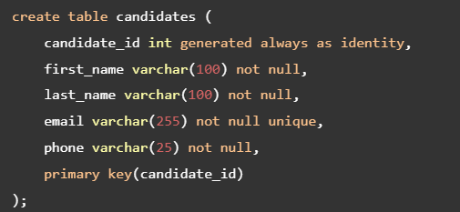
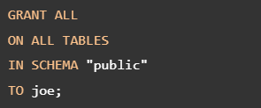
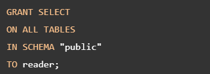

## DATA CONTROL LANGUAGE

**Content**

## Data Control Language

-   Data control language (DCL) is used to access the stored data.

**List of DCL commands:**

-   **GRANT:** This command gives users access privileges to the database.
-   **REVOKE:** This command withdraws the user’s access privileges given by using the GRANT command.

## PostgreSQL GRANT

-   After creating a role with the LOGIN attribute, the role can log in to the PostgreSQL database server. However, it cannot do anything to the database objects like tables, views, functions, etc.
-   For example, the user role cannot select data from a table or execute a specific function.
-   To allow the user role to interact with database objects, you need to grant privileges on the database objects to the user role by using the GRANT statement.
-   The following shows the simple form of the GRANT statement that grants one or more privileges on a table to a role:

In this syntax:

-   **First,** specify the **privilege_list** that can be SELECT, INSERT, UPDATE, DELETE, TRUNCATE, etc. You use the ALL option to grant all privileges on a table to the role.
-   **Second,** specify the **name of the table** after the ON keyword.
-   **Third,** specify the **name of the role** to which you want to grant privileges.

## PostgreSQL GRANT Statement Examples

-   **First,** use the postgres user to connect to the PostgreSQL database server using any **client tool** of your choice.
-   **Second,** create a new user role called joe that can login to the PostgreSQL database server:

-   **Third,** create a new table called **candidates**:

-   **Fourth,** use the role joe to login to the PostgreSQL database server in a separate session.
-   **Fifth**, attempt to select data from the candidates table from the joe‘s session:

-   PostgreSQL issued an error:

-   To grant the SELECT privilege on the candidates table to the role joe, you execute the following GRANT statement in the postgres‘ session:

-   **Sixth,** execute the SELECT statement from the joe‘s session:

-   PostgreSQL returns an empty result set instead of an error.
-   **Seventh,** execute the following INSERTstatement:

-   PostgreSQL issued the following error because joe does not have the INSERT privilege on the candidates table:

-   **Eighth,** grant INSERT, UPDATE, and DELETE privileges on the candidates table to the role joe:

-   **Ninth,** execute the INSERT statement again from the joe‘s session:

-   Now, joe can insert data into the candidates table. In addition, it can update or delete data from the table.

## PostgreSQL GRANT Examples

-   Let’s takes some more examples of using the GRANT statement.

**1) Grant all privileges on a table to a role**

-   The following statement grants all privileges on the candidates table to the role joe:

**2) Grant all privileges on all tables in a schema to a role**

-   The following statement grants all privileges on all tables in the public schema of the dvdrental sample database to the role joe:

**3) Grant SELECT on all tables**

-   Sometimes, you want to create a readonly role that can only select data from all tables in a specified schema.
-   In order to do that, you can grant SELECT privilege on all tables in the public schema like this:

-   So far, you have learned how to grant privileges on tables. To grant privileges on other objects, check it out the GRANT statement syntax.

# PostgreSQL REVOKE

The REVOKE statement revokes previously [granted privileges](https://www.postgresqltutorial.com/postgresql-administration/postgresql-grant/) on database objects from a [role](https://www.postgresqltutorial.com/postgresql-roles/).

The following shows the syntax of the REVOKE statement that revokes privileges on one or more tables from a role:

In this syntax:

-   First, specify the one or more privileges that you want to revoke. You use the ALL option to revoke all privileges.
-   Second, specify the name of the table after the ON keyword. You use the ALL TABLES to revoke specified privileges from all tables in a schema.
-   Third, specify the name of the role from which you want to revoke privileges.

## PostgreSQL REVOKE statement example

Let’s take an example of using the REVOKE statement.

### Step 1. Create a role and grant privileges

First, use the postgres user to log in to the dvdrental [sample database](https://www.postgresqltutorial.com/postgresql-sample-database/):

Second, [create a new role](https://www.postgresqltutorial.com/postgresql-roles/) called jim with the LOGIN and PASSWORD attributes:

Third, grant all privileges on the film table to the role jim:

Finally, grant the SELECT privilege on the actor table to the role jim:

### Step 2. Revoke privileges from a role

To revoke the SELECT privilege on the actor table from the role jim, you use the following statement:

To revoke all privileges on the film table from the role jim, you use REVOKE statement with the ALL option like this:

## Revoking privileges on other database objects

To revoke privileges from other database objects such as [sequences](https://www.postgresqltutorial.com/postgresql-tutorial/postgresql-sequences/), [functions](https://www.postgresqltutorial.com/postgresql-functions/), [stored procedures](https://www.postgresqltutorial.com/postgresql-create-procedure/), [schemas](https://www.postgresqltutorial.com/postgresql-schema/), [databases](https://www.postgresqltutorial.com/postgresql-create-database/), check it out [the REVOKE statement](https://www.postgresql.org/docs/current/sql-revoke.html).

Refernces

<https://www.postgresqltutorial.com/postgresql-administration/postgresql-grant/>

https://www.postgresqltutorial.com/postgresql-administration/postgresql-revoke/
