# PostgreSQL Sample Database

**Content**

**1. PostgreSQL Sample Database**

1.1 DVD Rental ER Model

1.2 PostgreSQL Sample Database Tables

1.3 Download the PostgreSQL sample database

1.4 Download printable ER diagram

**2. Load PostgreSQL Sample Database**

2.1 Load the sample database using psql tool

2.2 Load the DVD Rental database using the pgAdmin

**3. References**

# 1. PostgreSQL Sample Database

-   PostgreSQL provides sample database that you can use for learning and practicing PostgreSQL.
-   The sample DVD rental database to demonstrate the features of PostgreSQL.
-   The DVD rental database represents the business processes of a DVD rental store.

The DVD rental database has many objects, including:

-   15 tables
-   1 trigger
-   7 views
-   8 functions
-   1 domain
-   13 sequences

# 1.1 DVD Rental ER Model

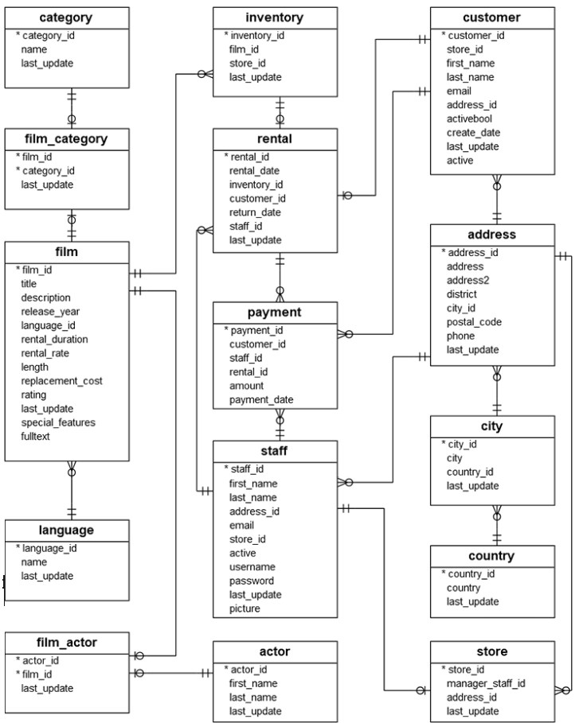

## 1.2 PostgreSQL Sample Database Tables

There are 15 tables in the DVD Rental database:

-   actor – stores actors data including first name and last name.
-   film – stores film data such as title, release year, length, rating, etc.
-   film_actor – stores the relationships between films and actors.
-   category – stores film’s categories data.
-   film_category- stores the relationships between films and categories.
-   store – contains the store data including manager staff and address.
-   inventory – stores inventory data.
-   rental – stores rental data.
-   payment – stores customer’s payments.
-   staff – stores staff data.
-   customer – stores customer data.
-   address – stores address data for staff and customers
-   city – stores city names.
-   country – stores country names.

## 1.3 Download the PostgreSQL sample database

-   You can download the PostgreSQL DVD Rental sample database via the following link:

[Download DVD Rental Sample Database](https://www.postgresqltutorial.com/wp-content/uploads/2019/05/dvdrental.zip)

-   The database file is in zipformat ( dvdrental.zip) so you need to extract it to dvdrental.tar [before loading the sample database into the PostgreSQL database server](https://www.postgresqltutorial.com/load-postgresql-sample-database/).

## 1.4 Download printable ER diagram

-   Besides the sample database, we provide you with a printable ER diagram in PDF format. You can download and print the ER diagram for reference while practicing PostgreSQL.

[Download the Printable ER Diagram](https://www.postgresqltutorial.com/wp-content/uploads/2018/03/printable-postgresql-sample-database-diagram.pdf)

# 2. Load PostgreSQL Sample Database

-   How to load the **PostgreSQL sample database** into the PostgreSQL database server.

Before going forward, you need to have:

-   A PostgreSQL database server installed on your system.
-   A PostgreSQL sample database called dvdrental.

## 2.1 Load the sample database using psql tool

**Step 1:** launch the **psql** tool.

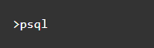

**Step 2:** Enter the account’s information to log in to the PostgreSQL database server. You can use the default value provided by psql by pressing the **Enter** keyboard. However, for the password, you need to enter the one that you provided during PostgreSQL installation.

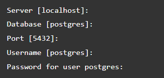

**Step 3:** Enter the following **CREATE DATABASE** statement to create a new **dvdrental** database.

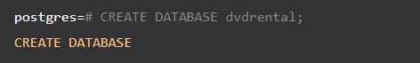

PostgreSQL will create a new database named dvdrental.

**Step 4:** Enter the exit command to quit psql:

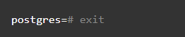

**Step 5:** Navigate the **bin** folder of the PostgreSQL installation folder:

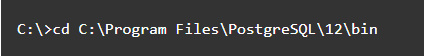

**Step 6:** Use the **pg_restore** tool to load data into the **dvdrental** database:

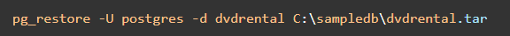

In this command:

-   The **-U postgres** specifies the postgresuser to login to the PostgreSQL database server.
-   The **-d dvdrental** specifies the target database to load.

**Step 7:** Enter the password for the **postgres** user and press enter

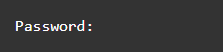

-   It takes about seconds to load data stored in the dvdrental.tar file into the dvdrentaldatabase.

## 2.2 Load the DVD Rental database using the pgAdmin

-   The following shows you step by step on how to use the pgAdmin tool to restore the sample database from the database file:

**Step 1:** Launch the **pgAdmin** tool and connect to the PostgreSQL server.

**Step 2:** Right click the **Databases** and select the **Create \> Database…** menu option:

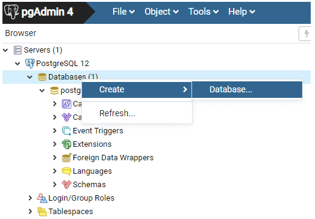

**Step 3:** Enter the database name dvdrental and click the **Save** button:

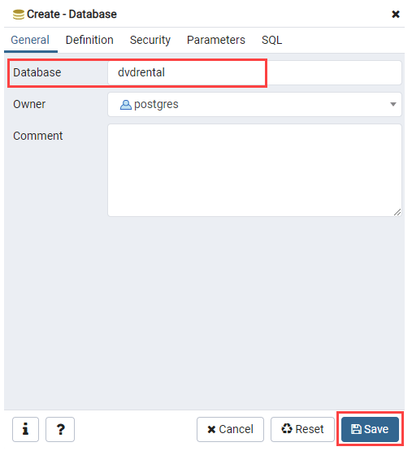

**Step 4:** Expand database node, you’ll see the new empty database created under the Databases node:

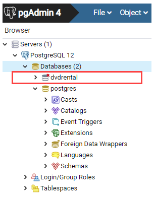

**Step 5:** Right-click on the **dvdrental** database and choose **Restore…** menu item to restore the database from the downloaded database file:

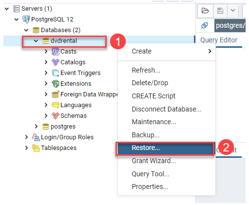

**Step 6:** Enter the path to the sample database file e.g., **c:\\sampledb\\dvdrental.tar** and click the **Restore** button:

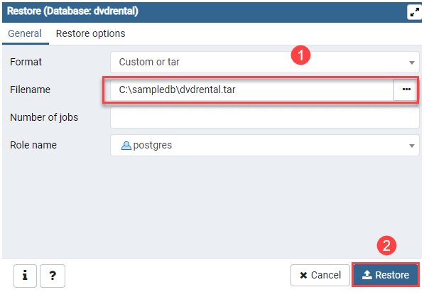

**Step 7:** The restoration process will complete in few seconds and shows the following dialog once it completes:

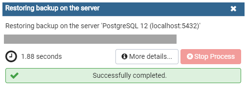

**Step 8:** Open the dvdrental database from object browser panel, you will find tables in the public schema and other database objects as shown in the following picture:

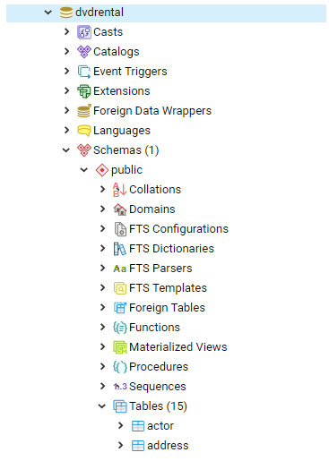

# 3. References

1.  https://www.postgresqltutorial.com/postgresql-getting-started/postgresql-sample-database/
2.  https://www.postgresqltutorial.com/postgresql-getting-started/load-postgresql-sample-database/
