# PostgreSQL

**Content**

**1. What is PostgreSQL**

1.1 Why use PostgreSQL?

**2. PostgreSQL on Windows**

2.1 Download PostgreSQL Installer for Windows

2.2 Install PostgreSQL on Window

2.3 Connect to a PostgreSQL Database Server

2.3.1 Connect to PostgreSQL database server using psql

2.3.2 Connect to PostgreSQL database server using pgAdmin

**3. References**

# 1. What is PostgreSQL

-   PostgreSQL is a powerful, open source object-relational database system that uses and extends the SQL language combined with many features that safely store and scale the most complicated data workloads.
-   PostgreSQL has earned a strong reputation for its proven architecture, reliability, data integrity, robust feature set, extensibility, and the dedication of the open source community behind the software to consistently deliver performant and innovative solutions.
-   PostgreSQL supports both SQL (relational) and JSON (non-relational) querying.

## 1.1 Why use PostgreSQL?

-   PostgreSQL comes with **many features** aimed to help developers build applications, administrators to protect data integrity and build fault-tolerant environments, and help you manage your data no matter how big or small the dataset.
-   In addition to being **free and open source**, PostgreSQL is highly extensible. For example, you can define your own data types, build out custom functions, even write code from **different programming languages** without recompiling your database!
-   Many of the features required by the SQL standard are supported, though sometimes with slightly differing syntax or function.

# 2. PostgreSQL on Windows

-   PostgreSQL was developed for UNIX-like platforms, however, it was designed to be portable. It means that PostgreSQL can also run on other platforms such as macOS, Solaris, and Windows.
-   Since version 8.0, PostgreSQL offers an installer for Windows systems that makes the installation process easier and faster. For development purposes, we will install PostgreSQL version 12 on Windows 10.

There are three steps to complete the PostgreSQL installation:

1.  Download PostgreSQL installer for Windows
2.  Install PostgreSQL
3.  Connect to a PostgreSQL Database Server

## 2.1 Download PostgreSQL Installer for Windows

-   First, you need to go to the download page of PostgreSQL installers on the EnterpriseDB.
-   Second, click the download link as shown below:

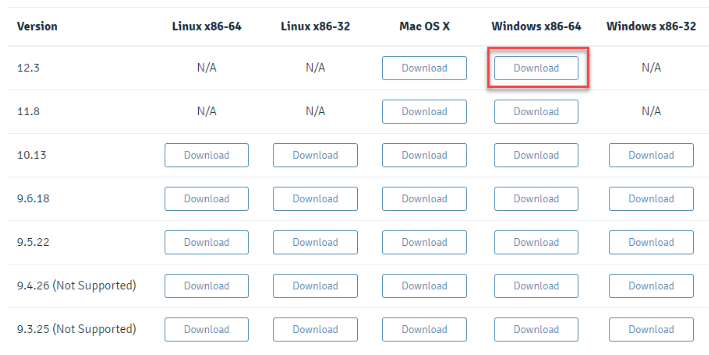

-   It will take a few minutes to complete the download.

## 2.2 Install PostgreSQL on Window

-   To install PostgreSQL on Windows, you need to have administrator privileges.

**Step 1.** Double click on the installer file, an installation wizard will appear and guide you through multiple steps where you can choose different options that you would like to have in PostgreSQL.

**Step 2.** Click the Next button.

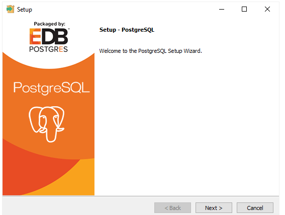

**Step 3.** Specify installation folder, choose your own or keep the default folder suggested by PostgreSQL installer and click the Next button.

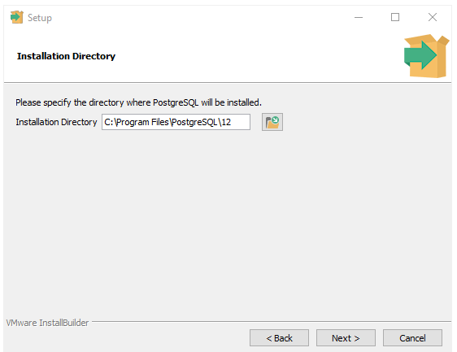

**Step 4.** Select software components to install:

-   The **PostgreSQL Server** to install the PostgreSQL database server.
-   **pgAdmin 4** to install the PostgreSQL database GUI management tool.
-   **Command Line Tools** to install command-line tools such as psql, pg_restore, etc. These tools allow you to interact with the PostgreSQL database server using the command-line interface.
-   Stack Builder provides a GUI that allows you to download and install drivers that work with PostgreSQL. You don’t need to install Stack Builder so feel free to uncheck it and click the Next button to select the data directory:

**Step 5.** Select the database directory to store the data or accept the default folder. And click the Next button to go to the next step:

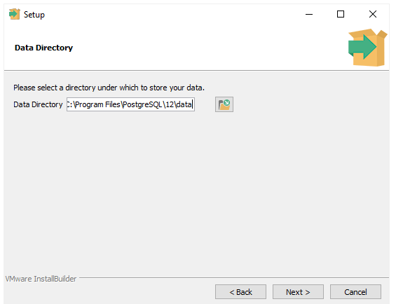

**Step 6.** Enter the password for the database superuser (postgres)

-   PostgreSQL runs as a service in the background under a service account named postgres. If you already created a service account with the name postgres, you need to provide the password of that account in the following window.
-   After entering the password, you need to retype it to confirm and click the Next button:

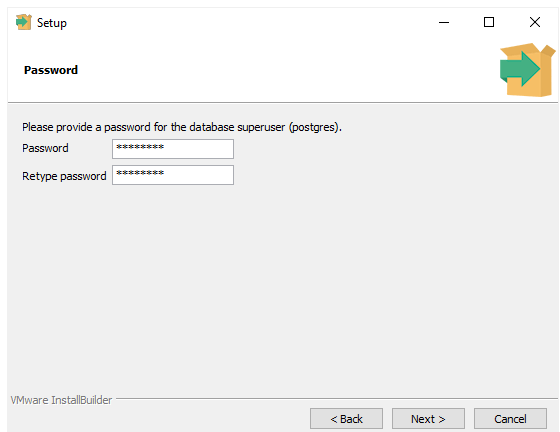

**Step 7.** Enter a port number on which the PostgreSQL database server will listen.

-   The default port of PostgreSQL is 5432. You need to make sure that no other applications are using this port.

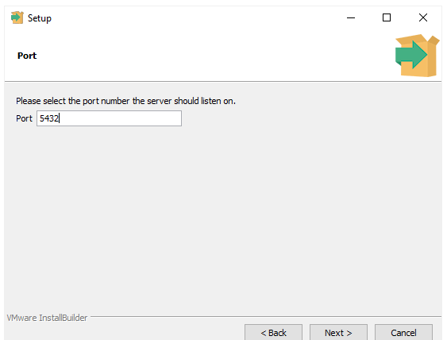

**Step 8.** Choose the default locale used by the PostgreSQL database. If you leave it as default locale, PostgreSQL will use the operating system locale. After that click the Next button.

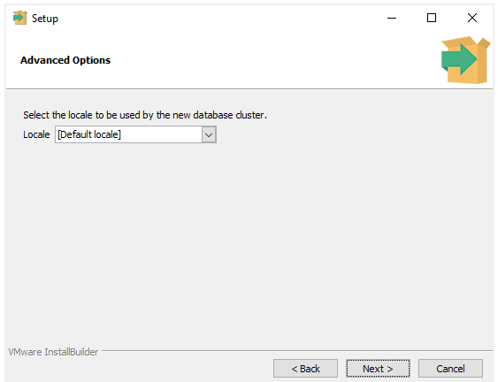

**Step 9.** The setup wizard will show the summary information of PostgreSQL. You need to review it and click the Next button if everything is correct. Otherwise, you need to click the Back button to change the configuration accordingly.

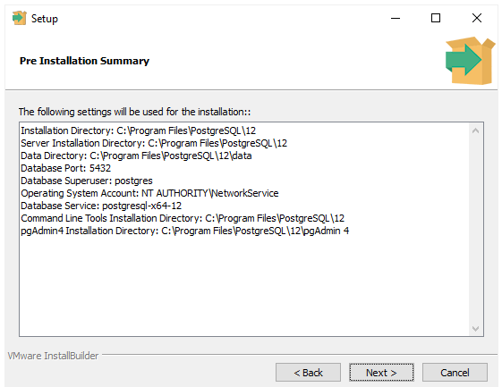

-   Now, you’re ready to install PostgreSQL on your computer. Click the **Next** button to begin installing PostgreSQL.

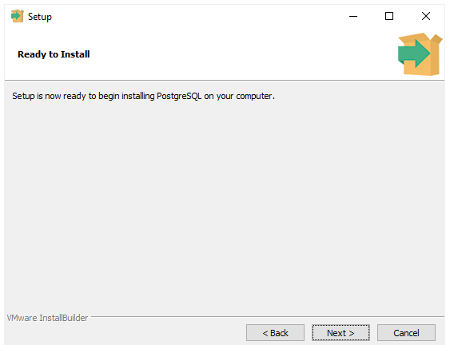

-   The installation may take a few minutes to complete.

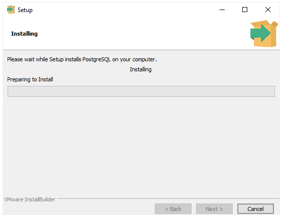

**Step 10.** Click the **Finish** button to complete the PostgreSQL installation.

# 2.3 Connect to a PostgreSQL Database Server

-   When you installed the PostgreSQL database server, the PostgreSQL installer also installed some useful tools for working with the PostgreSQL database server.
-   You will learn how to connect to the PostgreSQL database server via the following tools:
1.  **psql** – a terminal-based front-end to PostgreSQL database server.
2.  **pgAdmin** – a web-based front-end to PostgreSQL database server.

# 2.3.1 Connect to PostgreSQL database server using psql

-   psql is an interactive terminal program provided by PostgreSQL.
-   It allows you to interact with the PostgreSQL database server such as executing SQL statements and managing database objects.

**The following steps show you how to connect to the PostgreSQL database server via the psql program:**

**Step 1:** Launch the **psql** program and connect to the PostgreSQL Database Server using the **postgres** user:

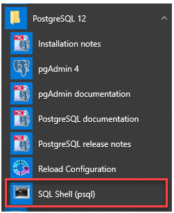

**Step 2:** Enter all the information such as Server, Database, Port, Username, and Password. If you press Enter, the program will use the default value specified in the square bracket [] and move the cursor to the new line. For example, localhost is the default database server. In the step for entering the password for user postgres, you need to enter the password the user postgres that you choose during the PostgreSQL installation.

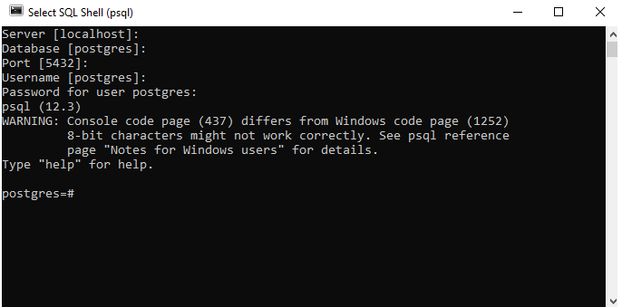

**Step 3:** Interact with the PostgreSQL Database Server by issuing an SQL statement. The following statement returns the current version of PostgreSQL:

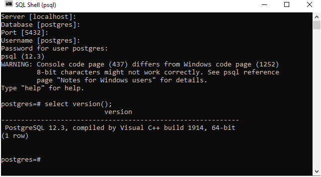

-   Please do not forget to end the statement with a semicolon (;). After pressing **Enter**, psql will return the current PostgreSQL version on your system.

## 2.3.2 Connect to PostgreSQL database server using pgAdmin

-   The second way to connect to a database is by using a pgAdmin application.
-   The pgAdmin application allows you to interact with the PostgreSQL database server via an intuitive user interface.

**The following illustrates how to connect to a database using pgAdmin GUI application:**

**Step 1:** Launch the pgAdmin application.

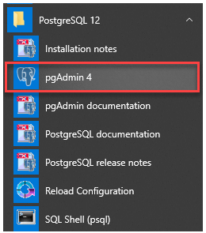

-   The pgAdmin application will launch on the web browser as shown in the following picture:

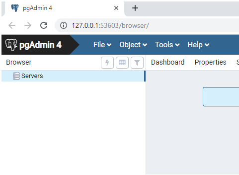

**Step 2:** Right-click the Servers node and select **Create \> Server…** menu to create a server

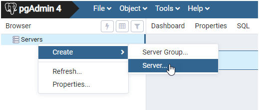

**Step 3:** Enter the server name e.g., **PostgreSQL** and click the **Connection** tab:

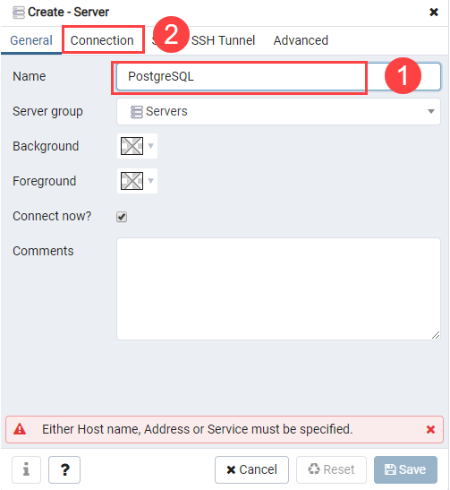

**Step 4:** Enter the host and password for the **postgres** user and click the **Save** button:

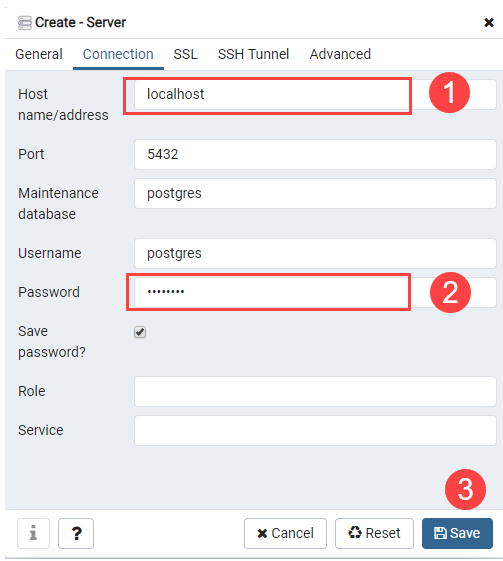

**Step 5:** Click on the **Servers node** to expand the server. By default, PostgreSQL has a database named **postgres** as shown below:

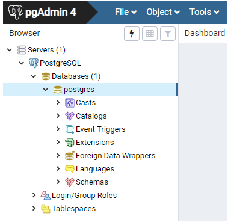

**Step 6:** Open the query tool by choosing the menu item **Tool \> Query Tool** or click the **lightning icon.**

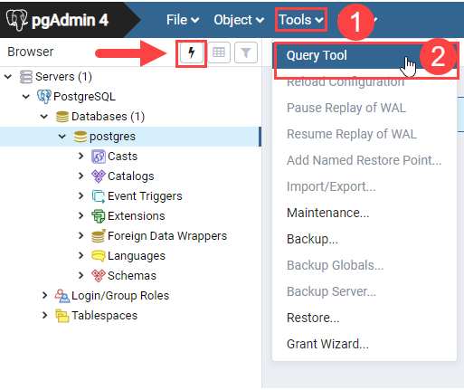

**Step 7:** Enter the query in the **Query Editor**, click the **Execute** button, you will see the result of the query displaying in the **Data Output** tab:

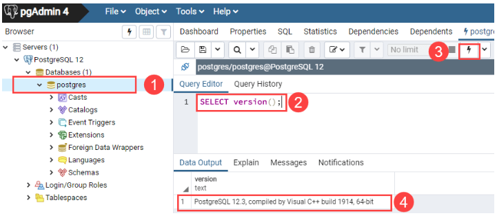

## 3. References

1.  https://www.postgresqltutorial.com/postgresql-getting-started/what-is-postgresql/
2.  https://www.postgresqltutorial.com/postgresql-getting-started/install-postgresql/
3.  https://www.postgresqltutorial.com/postgresql-getting-started/connect-to-postgresql-database/
