## Joins

**Content**

1\. PostgreSQL Joins

1.2 Sample tables

2\. PostgreSQL inner join

3\. PostgreSQL left join

4\. PostgreSQL right join

5\. PostgreSQL full outer join/ full join

6\. References

## 1. PostgreSQL Joins

-   PostgreSQL join is used to combine columns from one (self-join) or more tables based on the values of the common columns between related tables.
-   The common columns are typically the primary key columns of the first table and foreign key columns of the second table.
-   PostgreSQL supports inner join, left join, right join, full outer join, cross join, natural join, and a special kind of join called self-join.

## 1.2 Sample tables

-   Suppose you have two tables called **basket_a** and **basket_b** that store fruits:

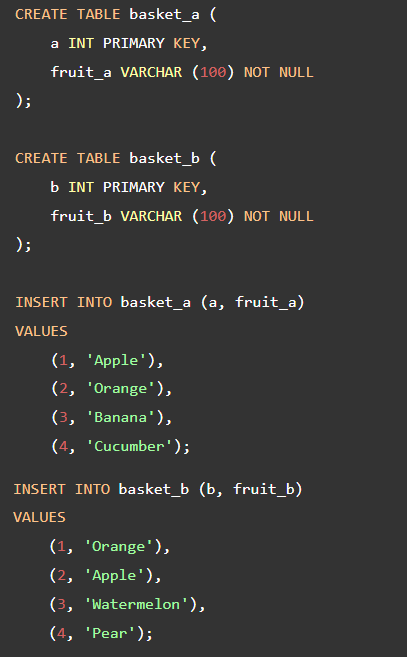

-   The tables have some common fruits such as **apple** and **orange.**
-   The following statement returns data from the **basket_a** table:

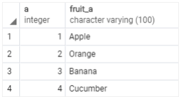

-   And the following statement returns data from the **basket_b** table:

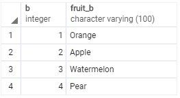

## 2. PostgreSQL inner join

-   The following statement joins the first table (**basket_a**) with the second table (**basket_b**) by matching the values in the **fruit_a** and **fruit_b** columns:

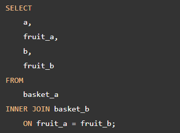

**Output**

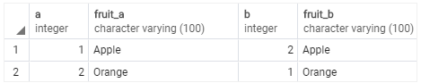

-   The inner join examines each row in the first table (basket_a).
-   It compares the value in the fruit_a column with the value in the fruit_b column of each row in the second table (basket_b).
-   If these values are equal, the inner join creates a new row that contains columns from both tables and adds this new row the result set.
-   The following Venn diagram illustrates the inner join:

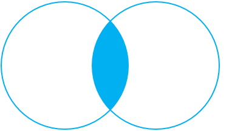

## 3. PostgreSQL left join

-   The following statement uses the left join clause to join the basket_a table with the basket_b table.
-   In the left join context, the first table is called the left table and the second table is called the right table.

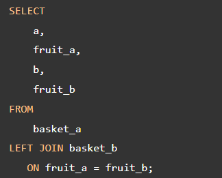

**Output**

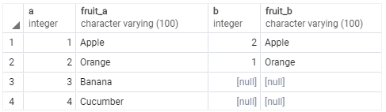

-   The left join starts selecting data from the left table.
-   It compares values in the fruit_a column with the values in the fruit_b column in the basket_b table.
-   If these values are equal, the left join creates a new row that contains columns of both tables and adds this new row to the result set. (see the row \#1 and \#2 in the result set).
-   In case the values do not equal, the left join also creates a new row that contains columns from both tables and adds it to the result set. However, it fills the columns of the right table (basket_b) with null. (see the row \#3 and \#4 in the result set).
-   The following Venn diagram illustrates the left join:

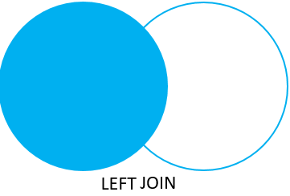

-   To select rows from the left table that do not have matching rows in the right table, you use the left join with a **WHERE** clause. For example:

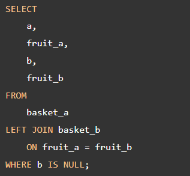

**Output**

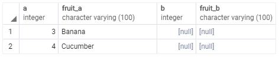

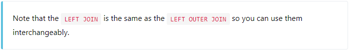

-   The following Venn diagram illustrates the left join that returns rows from the left table that do not have matching rows from the right table:

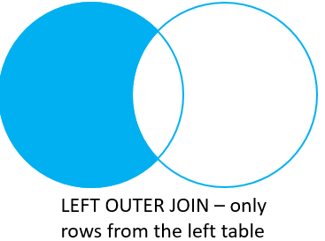

## 4. PostgreSQL right join

-   The right join is a reversed version of the left join.
-   The right join starts selecting data from the right table. It compares each value in the fruit_b column of every row in the right table with each value in the fruit_a column of every row in the fruit_a table.
-   If these values are equal, the right join creates a new row that contains columns from both tables.
-   In case these values are not equal, the right join also creates a new row that contains columns from both tables. However, it fills the columns in the left table with NULL.
-   The following statement uses the right join to join the basket_a table with the basket_b table:

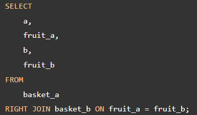

**Output**

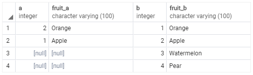

-   The following Venn diagram illustrates the right join:

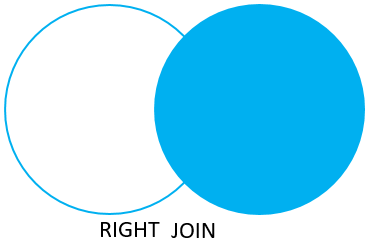

-   Similarly, you can get rows from the right table that do not have matching rows from the left table by adding a WHERE clause as follows:

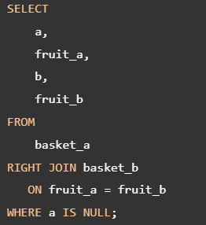

**Output**

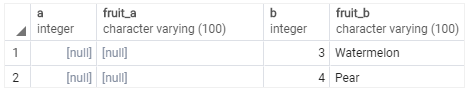

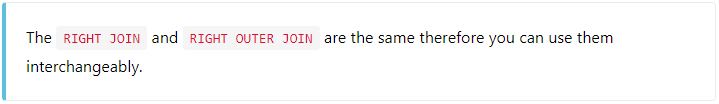

-   The following Venn diagram illustrates the right join that returns rows from the right table that do not have matching rows in the left table:

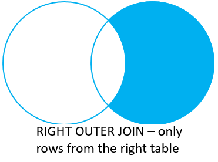

## 5. PostgreSQL full outer join/ full join

-   The **full outer join or full join** returns a result set that contains all rows from both left and right tables, with the matching rows from both sides if available.
-   In case there is no match, the columns of the table will be filled with NULL.

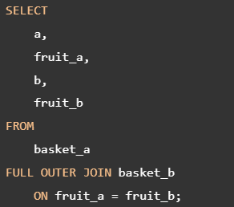

**Output:**

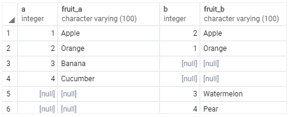

-   The following Venn diagram illustrates the full outer join:

-   To return rows in a table that do not have matching rows in the other, you use the full join with a WHERE clause like this:

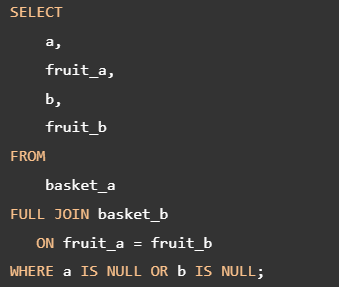

**Output**

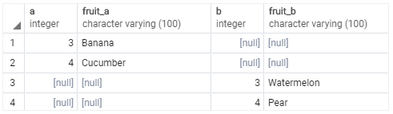

-   The following Venn diagram illustrates the full outer join that returns rows from a table that do not have the corresponding rows in the other table:

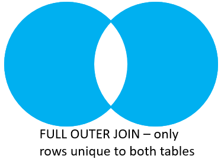

-   The following picture shows all the PostgreSQL joins that we discussed so far with the detailed syntax:

## 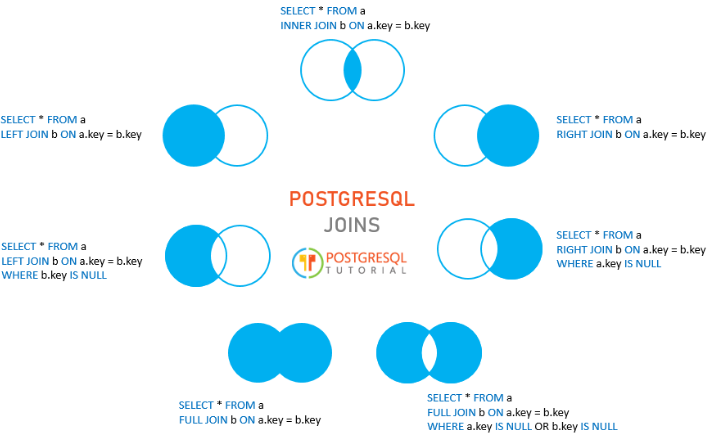

## 6. References

https://www.postgresqltutorial.com/postgresql-tutorial/postgresql-joins/
