## What Is Normalization in SQL?

-   Normalization is the process to eliminate data redundancy and enhance data integrity in the table. Normalization also helps to organize the data in the database. It is a multi-step process that sets the data into tabular form and removes the duplicated data from the relational tables.
-   Normalization organizes the columns and tables of a database to ensure that database integrity constraints properly execute their dependencies. It is a systematic technique of decomposing tables to eliminate data redundancy (repetition) and undesirable characteristics like Insertion, Update, and Deletion anomalies.
-   Also Read: [The Ultimate Guide on SQL Basics](https://www.simplilearn.com/tutorials/sql-tutorial/what-is-sql)
-   In 1970 Edgar F. Codd defined the First Normal Form.
-   Now let's understand the types of Normal forms with the help of examples.

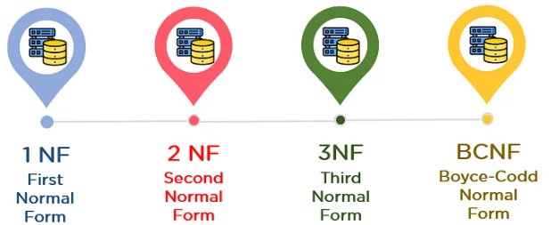

## 1st Normal Form (1NF)

-   A table is referred to as being in its First Normal Form if atomicity of the table is 1.
-   Here, atomicity states that a single cell cannot hold multiple values. It must hold only a single-valued attribute.
-   The First normal form disallows the multi-valued attribute, composite attribute, and their combinations.
-   Now you will understand the First Normal Form with the help of an example.
-   Below is a students’ record table that has information about student roll number, student name, student course, and age of the student.

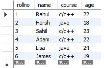

-   In the studentsrecord table, you can see that the course column has two values. Thus it does not follow the First Normal Form. Now, if you use the First Normal Form to the above table, you get the below table as a result.

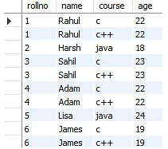

-   By applying the First Normal Form, you achieve atomicity, and also every column has unique values.
-   Before proceeding with the Second Normal Form, get familiar with Candidate Key and Super Key.

## Candidate Key

-   A candidate key is a set of one or more columns that can identify a record uniquely in a table, and YOU can use each candidate key as a Primary Key.
-   Now, let’s use an example to understand this better.

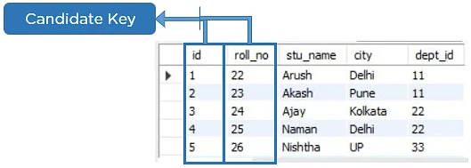

## Super Key

-   Super key is a set of over one key that can identify a record uniquely in a table, and the Primary Key is a subset of Super Key.
-   Let’s understand this with the help of an example.

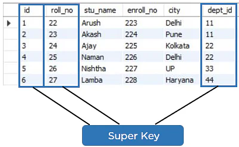

## Second Normal Form (2NF)

-   The first condition for the table to be in Second Normal Form is that the table has to be in First Normal Form. The table should not possess partial dependency. The partial dependency here means the proper subset of the candidate key should give a non-prime attribute.
-   Now understand the Second Normal Form with the help of an example.
-   Consider the table Location:

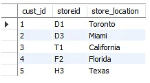

-   The Location table possesses a composite primary key cust_id, storeid. The non-key attribute is store_location. In this case, store_location only depends on storeid, which is a part of the primary key. Hence, this table does not fulfill the second normal form.
-   To bring the table to Second Normal Form, you need to split the table into two parts. This will give you the below tables:

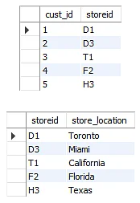

-   As you have removed the partial functional dependency from the location table, the column store_location entirely depends on the primary key of that table, storeid.
-   Now that you understood the 1st and 2nd Normal forms, you will look at the next part of this Normalization in SQL tutorial.

## Third Normal Form (3NF)

-   The first condition for the table to be in Third Normal Form is that the table should be in the Second Normal Form.
-   The second condition is that there should be no transitive dependency for non-prime attributes, which indicates that non-prime attributes (which are not a part of the candidate key) should not depend on other non-prime attributes in a table. Therefore, a transitive dependency is a functional dependency in which A → C (A determines C) indirectly, because of A → B and B → C (where it is not the case that B → A).
-   The third Normal Form ensures the reduction of data duplication. It is also used to achieve data integrity.
-   Below is a student table that has student id, student name, subject id, subject name, and address of the student as its columns.

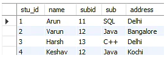

-   In the above student table, stu_id determines subid, and subid determines sub. Therefore, stu_id determines sub via subid. This implies that the table possesses a transitive functional dependency, and it does not fulfill the third normal form criteria.
-   Now to change the table to the third normal form, you need to divide the table as shown below:

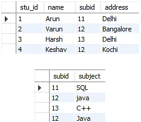

-   As you can see in both the tables, all the non-key attributes are now fully functional, dependent only on the primary key. In the first table, columns name, subid, and addresses only depend on stu_id. In the second table, the sub only depends on subid.

## Boyce CoddNormal Form (BCNF)

-   Boyce Codd Normal Form is also known as 3.5 NF. It is the superior version of 3NF and was developed by Raymond F. Boyce and Edgar F. Codd to tackle certain types of anomalies which were not resolved with 3NF.
-   The first condition for the table to be in Boyce Codd Normal Form is that the table should be in the third normal form. Secondly, every Right-Hand Side (RHS) attribute of the functional dependencies should depend on the super key of that particular table.
-   For example :
-   You have a functional dependency X → Y. In the particular functional dependency, X has to be the part of the super key of the provided table.
-   Consider the below subject table:

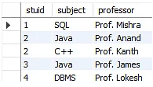

The subject table follows these conditions:

-   Each student can enroll in multiple subjects.
-   Multiple professors can teach a particular subject.
-   For each subject, it assigns a professor to the student.

In the above table, student_id and subject together form the primary key because using student_id and subject; you can determine all the table columns.

Another important point to be noted here is that one professor teaches only one subject, but one subject may have two professors.

Which exhibit there is a dependency between subject and professor, i.e. subject depends on the professor's name.

to

-   The table is in 1st Normal form as all the column names are unique, all values are atomic, and all the values stored in a particular column are of the same domain.
-   The table also satisfies the 2nd Normal Form, as there is no Partial Dependency.
-   And, there is no Transitive Dependency; hence, the table also satisfies the 3rd Normal Form.
-   This table follows all the Normal forms except the Boyce Codd Normal Form.
-   As you can see stuid, and subject forms the primary key, which means the subject attribute is a prime attribute.
-   However, there exists yet another dependency - professor → subject.
-   BCNF does not follow in the table as a subject is a prime attribute, the professor is a non-prime attribute.
-   To transform the table into the BCNF, you will divide the table into two parts. One table will hold stuid which already exists and the second table will hold a newly created column profid.

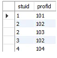

-   And in the second table will have the columns profid, subject, and professor, which satisfies the BCNF.

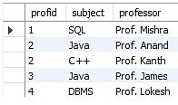

## Conclusion

-   you have seen Normalization in SQL and understood the different Normal forms of Normalization. Now, you can organize the data in the database and remove the data redundancy and promote data integrity.

## References

1.  https://www.simplilearn.com/tutorials/sql-tutorial/what-is-normalization-in-sql
