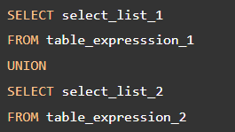
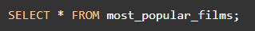
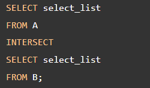

# SET OPERATIONS

**Content**

**1. PostgreSQL UNION**

1.1 PostgreSQL UNION with ORDER BY clause

1.2 Sample tables

1.3 PostgreSQL UNION Examples

**2. PostgreSQL INTERSECT**

2.1 PostgreSQL INTERSECT with ORDER BY Clause

2.2 PostgreSQL INTERSECT Examples

**3. References**

## 1. PostgreSQL UNION

-   The UNION operator combines result sets of two or more SELECT statements into a single result set.
-   The following illustrates the syntax of the UNION operator that combines result sets from two queries:

-   To combine the result sets of two queries using the UNION operator, the queries must conform to the following rules:
1.  The number and the order of the columns in the select list of both queries must be the same.
2.  The data types must be compatible.
-   The UNION operator removes all duplicate rows from the combined data set.
-   To retain the duplicate rows, you use the the UNION ALL instead.
-   The following Venn digram illustrates how to the UNION works:

## 1.1 PostgreSQL UNION with ORDER BY clause

-   The UNION operator may place the rows from the result set of the first query before, after, or between the rows from the result set of the second query.
-   To sort rows in the final result set, you use the ORDER BY clause in the second query.
-   In practice, you often use the UNION operator to combine data from similar tables, which are not perfectly normalized, in the data warehouse or business intelligence systems.

## 1.2 Sample tables

-   The following statements create two tables: **top_rated_films** and **most_popular_films**, and insert data into these tables:

-   The following shows the data from the **top_rated_films** table:

**Output**

-   The following statement returns the data from the most_popular_films table:

**Output**

## 1.3 PostgreSQL UNION Examples

-   Let’s take some examples of using the PostgreSQL UNION operator.

## 1) Simple PostgreSQL UNION example

-   The following statement uses the UNION operator to combine data from both tables:

-   The query returns the following result:

-   The result set includes five rows in the result set because the UNION operator removes one duplicate row.

## 2) PostgreSQL UNION ALL example

-   The following statement uses the UNION ALL operator to combine result sets from **the top_rated_films** and **most_popular_films** tables:

**Output**

-   In this example, the duplicate row is retained in the result set.

## 3) PostgreSQL UNION ALL with ORDER BY Clause Example

-   To sort the result returned by the UNION operator, you place the ORDER BY clause end of the last query like this:

**Output**

-   If you place the ORDER BY clause at the end of each query, the combined result set will not be sorted as you expected.
-   Because when UNION operator combines the sorted result sets from each query, it does not guarantee the order of rows in the final result set.

# 2. PostgreSQL INTERSECT

-   The PostgreSQL INTERSECT operator combines result sets of two or more SELECT statements into a single result set.
-   The INTERSECT operator returns any rows that are available in both result sets.
-   The following illustration shows the final result set produced by the INTERSECT operator.

-   The final result set is represented by the yellow area where circle A intersects with circle B.
-   The following illustrates the syntax of the INTERSECT operator:

To use the INTERSECT operator, the columns that appear in the SELECT statements must follow the folowing rules:

1.  The number of columns and their order in the SELECT clauses must be the same.
2.  The data types of the columns must be compatible.

## 2.1 PostgreSQL INTERSECT with ORDER BY Clause

-   If you want to sort the result set returned by the INTERSECT operator, you place the ORDER BY at the final query in the query list like this:

## 2.2 PostgreSQL INTERSECT Examples

-   We’ll use the **top_rated_films** and **most_popular_films** tables created in the UNION:
-   The **top_rated_films** table:

-   The **most_popular_films** table:

-   To get popular films which are also top rated films, you use the INTERSECT operator as follows:

-   The result set returns one film that appears on both tables.

## 3. References

https://www.postgresqltutorial.com/postgresql-tutorial/postgresql-union/

https://www.postgresqltutorial.com/postgresql-tutorial/postgresql-intersect/
