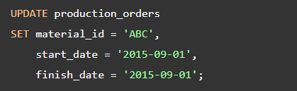

# SQL Constraints

**Content**

**1. SQL Constraints**

**1.1 PostgreSQL NOT NULL Constraint**

1.1.1 SQL NOT NULL on CREATE TABLE

1.1.2 Adding NOT NULL Constraint to Existing Columns

1.1.3 The Special Case of NOT NULL Constraint

**1.2 PostgreSQL UNIQUE Constraint**

1.2.1 PostgreSQL UNIQUE Constraint Example

1.2.2 Creating a UNIQUE Constraint on Multiple Columns

1.2.3 Adding Unique Constraint Using a Unique Index

**1.3 PostgreSQL CHECK Constraint**

1.3.1 Define PostgreSQL CHECK Constraint for New Tables

1.3.1 Define PostgreSQL CHECK constraints for existing tables

**2. References**

# 1. SQL Constraints

-   SQL constraints are used to specify **rules for data in a table.**
-   Constraints are used to limit the type of data that can go into a table.
-   This ensures the accuracy and reliability of the data in the table.
-   If there is any violation between the constraint and the data action, the action is aborted.
-   Constraints can be column level or table level. Column level constraints apply to a column, and table level constraints apply to the whole table.

The following constraints are commonly used in SQL:

-   **NOT NULL** - Ensures that a column cannot have a NULL value
-   **UNIQUE** - Ensures that all values in a column are different
-   **PRIMARY KEY** - A combination of a **NOT NULL** and **UNIQUE**. Uniquely identifies each row in a table
-   **FOREIGN KEY** - Prevents actions that would destroy links between tables
-   **CHECK** - Ensures that the values in a column satisfies a specific condition

## 1.1 PostgreSQL NOT NULL Constraint

-   By default, a column can hold NULL values.
-   The **NOT NULL** constraint enforces a column to **NOT accept NULL values.**
-   This enforces a field to always contain a value, which means that you cannot insert a new record, or update a record without adding a value to this field.

## 1.1.1 SQL NOT NULL on CREATE TABLE

## 1.1.2 Adding NOT NULL Constraint to Existing Columns

-   To add the NOT NULL constraint to a column of an existing table, you use the following form of the **ALTER TABLE** statement:

-   To add set **multiple NOT NULL** constraint to multiple columns, you use the following syntax:

**Example**

-   First, create a new table called **production orders** ( production_orders):

-   Next, **insert a new row** into the production_orders table:

-   Then, to make sure that the **qty** field is not null, you can add the not-null constraint to the **qty** column. However, the column already contains data. If you try to add the not-null constraint, **PostgreSQL will issue an error**.
-   To add the NOT NULL constraint to a column that already contains NULL, you need to update NULL to non-NULL first, like this:

-   The values in the qty column are updated to one. Now, you can add the NOT NULL constraint to the qty column:

-   After that, you can update the not-null constraints for material_id, start_date, and finish_date columns:

-   Add not-null constraints to multiple columns:

-   Finally, attempt to update values in the qty column to NULL:

-   PostgreSQL issued an error message:

## 1.1.3 The Special Case of NOT NULL Constraint

-   Besides the NOT NULL constraint, you can use a CHECK constraint to force a column to accept not NULL values.
-   The NOT NULL constraint is equivalent to the following CHECK constraint:

-   By default, PostgreSQL gives the CHECK constraint name using the following pattern:

-   However, if you want to assign a CHECK constraint a specific name, you can specify it after the CONSTRAINT expression. In the below example **username**
-   **\_email_notnull** is check constraint name.
-   This is useful because sometimes you may want either column a or b is not null, but not both.
-   For example, you may want either username or email column of the user tables is not null or empty. In this case, you can use the CHECK constraint as follows:

-   The following statement works.

-   However, the following statement will not work because it violates the CHECK constraint:

## Note

-   Use the NOT NULL constraint for a column to enforce a column not accept NULL. By default, a column can hold NULL.
-   To check if a value is NULL or not, you use the IS NULL operator. The IS NOT NULL negates the result of the IS NULL.
-   Never use equal operator = to compare a value with NULL because it always returns NULL.

# 1.2 PostgreSQL UNIQUE Constraint

-   UNIQUE constraint to make sure that values stored in a column or a group of columns are unique across rows in a table.
-   Sometimes, you want to ensure that values stored in a column or a group of columns are unique across the whole table such as email addresses or usernames.
-   PostgreSQL provides you with the UNIQUE constraint that maintains the uniqueness of the data correctly.
-   When a UNIQUE constraint is in place, every time you insert a new row, it checks if the value is already in the table. It rejects the change and issues an error if the value already exists. The same process is carried out for updating existing data.
-   When you add a UNIQUE constraint to a column or a group of columns, PostgreSQL will automatically create a unique index on the column or the group of columns.

## 1.2.1 PostgreSQL UNIQUE Constraint Example

-   The following statement creates a new table named **person** with a UNIQUE constraint for the email column.

-   **Note** that the UNIQUE constraint above can be **rewritten as a table constraint** as shown in the following query:

-   First, insert a new row into the person table using INSERT statement:

-   Second, insert another row with duplicate email.

-   PostgreSQL issued an error message.

## 1.2.2 Creating a UNIQUE Constraint on Multiple Columns

-   PostgreSQL allows you to create a UNIQUE constraint to a group of columns using the following syntax:

-   The combination of values in column c2 and c3 will be unique across the whole table.
-   The value of the column c2 or c3 needs not to be unique.

## 1.2.3 Adding Unique Constraint Using a Unique Index

-   Sometimes, you may want to add a unique constraint to an existing column or group of columns. Let’s take a look at the following example.
-   First, suppose you have a table named **equipment**:

-   Second, create a **unique index** based on the **equip_id** column.

-   Third, add a **unique constraint** to the equipment table using the **equipment_equip_id index.**

-   Notice that the ALTER TABLE statement acquires an exclusive **lock** on the table. If you have **any pending transactions**, it will **wait** for **all transactions to complete** before changing the table.
-   Therefore, you should check the **pg_stat_activity** table to see the current pending transactions that are on-going using the following query:

-   You should look at the result to find the state column with the value idle in transaction. Those are the transactions that are pending to complete.

# 1.3 PostgreSQL CHECK Constraint

-   A CHECK constraint is a kind of constraint that **allows you to specify if values in a column must meet a specific requirement.**
-   The CHECK constraint uses a **Boolean expression** to evaluate the values before they are inserted or updated to the column.
-   If the values pass the check, PostgreSQL will insert or update these values to the column. Otherwise, PostgreSQL will reject the changes and issue a constraint violation error.

## 1.3.1 Define PostgreSQL CHECK Constraint for New Tables

-   Typically, you use the CHECK constraint at the time of creating the table using the **CREATE TABLE** statement.
-   The following statement defines an **employees** table.

The employees table has three CHECK constraints:

1.  First, the **birth date** ( birth_date) of the employee must be greater than 01/01/1900. If you try to insert a birth date before 01/01/1900, you will receive an error message.
2.  Second, the **joined date** ( joined_date) must be greater than the birth date ( birth_date). This check will prevent from updating invalid dates in terms of their semantic meanings.
3.  Third, the **salary** must be greater than zero, which is obvious.
-   Let’s try to insert a **new row** into the employees table:

-   The statement attempted to insert a negative salary into the salary column. However, PostgreSQL returned the following error message:

-   The insert failed because of the CHECK constraint on the salary column that accepts only positive values.
-   By default, PostgreSQL gives the CHECK constraint a name using the following pattern:

-   For example, the constraint on the salary column has the following constraint name:

-   However, if you want to assign aCHECK constraint a specific name, you can specify it after the CONSTRAINT expression as follows:

-   See the following example:

## 1.3.1 Define PostgreSQL CHECK constraints for existing tables

-   To add CHECK constraints to existing tables, you use the **ALTER TABLE** statement.
-   Suppose, you have an existing table in the database named **prices_list**

-   Now, you can use ALTER TABLE statement to add the CHECK constraints to the prices_list table. The price and discount must be greater than zero and the discount is less than the price. Notice that we use a **Boolean expression** that contains the **AND** operators.

-   The valid to date ( valid_to) must be greater than or equal to valid from date ( valid_from).

-   The CHECK constraints are very useful to place additional logic to restrict values that the columns can accept at the database layer. By using the CHECK constraint, you can make sure that data is updated to the database correctly.

## 2. References

1.  https://www.w3schools.com/sql/sql_constraints.asp
2.  https://www.postgresqltutorial.com/postgresql-tutorial/postgresql-unique-constraint/
3.  https://www.postgresqltutorial.com/postgresql-tutorial/postgresql-not-null-constraint/
4.  https://www.postgresqltutorial.com/postgresql-tutorial/postgresql-check-constraint/
