## Foreign Key Constraint

**Content**

**1. Foreign Key Constraint**

1.1 PostgreSQL foreign key constraint syntax

1.2 PostgreSQL foreign key constraint examples

1.3 NO ACTION

1.4 SET NULL

1.5 CASCADE

1.6 SET DEFAULT

**2. Add a foreign key constraint to an existing table**

**3. References**

## 1. Foreign Key Constraint

-   A foreign key is a column or a group of columns in a table that reference the primary key of another table.
-   The table that contains the foreign key is called the referencing table or child table. And the table referenced by the foreign key is called the referenced table or parent table.
-   A table can have multiple foreign keys depending on its relationships with other tables.
-   In PostgreSQL, you define a foreign key using the foreign key constraint. The foreign key constraint helps maintain the referential integrity of data between the child and parent tables.
-   A foreign key constraint indicates that values in a column or a group of columns in the child table equal the values in a column or a group of columns of the parent table.

## 1.1 PostgreSQL foreign key constraint syntax

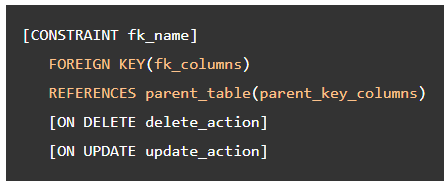

In the above syntax:

-   First, specify the name for the foreign key constraint after the CONSTRAINT keyword. The CONSTRAINT clause is optional. If you omit it, PostgreSQL will assign an auto-generated name.
-   Second, specify one or more foreign key columns in parentheses after the FOREIGN KEY keywords.
-   Third, specify the parent table and parent key columns referenced by the foreign key columns in the REFERENCES clause.
-   Finally, specify the delete and update actions in the **ON DELETE** and **ON UPDATE** clauses.

The delete and update actions determine the behaviors when the primary key in the parent table is deleted and updated. Since the primary key is rarely updated, the ON UPDATE action is not often used in practice. We’ll focus on the ON DELETE action.

**PostgreSQL supports the following actions:**

-   SET NULL
-   SET DEFAULT
-   RESTRICT
-   NO ACTION
-   CASCADE

## 1.2 PostgreSQL foreign key constraint examples

-   The following statements create the **customers** and **contacts** tables:

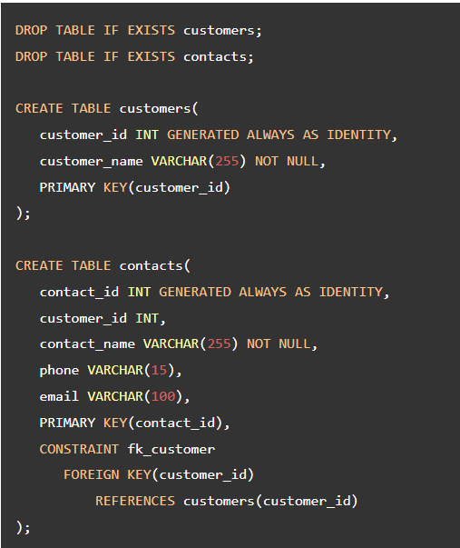

-   In the above example, the customers table is the parent table and the contacts table is the child table.
-   Each customer has zero or many contacts and each contact belongs to zero or one customer.
-   The customer_id column in the contacts table is the foreign key column that references the primary key column with the same name in the customers table.
-   The following foreign key constraint **fk_customer** in the contacts table defines the **customer_id** as the foreign key:

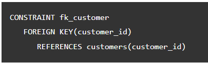

-   Here, the foreign key constraint does not have the **ON DELETE** and **ON** **UPDATE** action, they default to **NO ACTION.**

## 1.3 NO ACTION

-   The following inserts data into the customers and contacts tables:

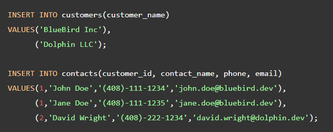

-   The following statement deletes the **customer id 1** from the customers table:

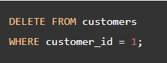

-   Because of the **ON DELETE NO ACTION,** PostgreSQL issues a constraint violation because the referencing rows of the customer id 1 still exist in the contacts table:

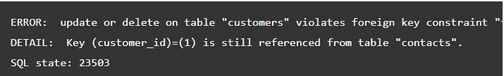

## 1.4 SET NULL

-   The **SET NULL** automatically sets **NULL** to the foreign key columns in the referencing rows of the child table when the referenced rows in the parent table are deleted.
-   The following statements drop the sample tables and re-create them with the foreign key that uses the **SET NULL** action in the **ON DELETE** clause:

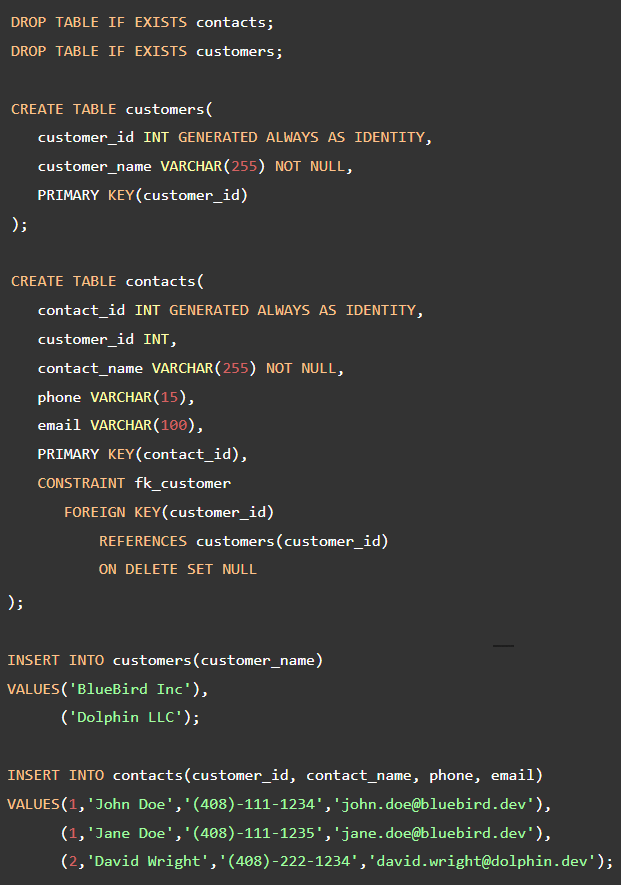

-   To see how the SET NULL works, let’s delete the **customer with id 1** from the **customers table**:

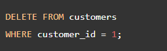

-   Because of the **ON DELETE SET NULL** action, the referencing rows in the contacts table set to **NULL**.
-   The following statement displays the data in the contacts table: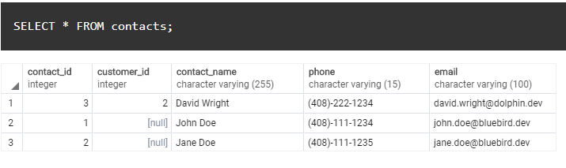
-   As can be seen clearly from the output, the rows that have the **customer_id** **1** now have the customer_id sets to **NULL**

## 1.5 CASCADE

-   The **ON DELETE CASCADE** automatically deletes all the referencing rows in the child table when the referenced rows in the parent table are deleted.
-   In practice, the ON DELETE CASCADE is the most commonly used option.
-   The following statements recreate the sample tables. However, the delete action of the fk_customer changes to CASCADE:

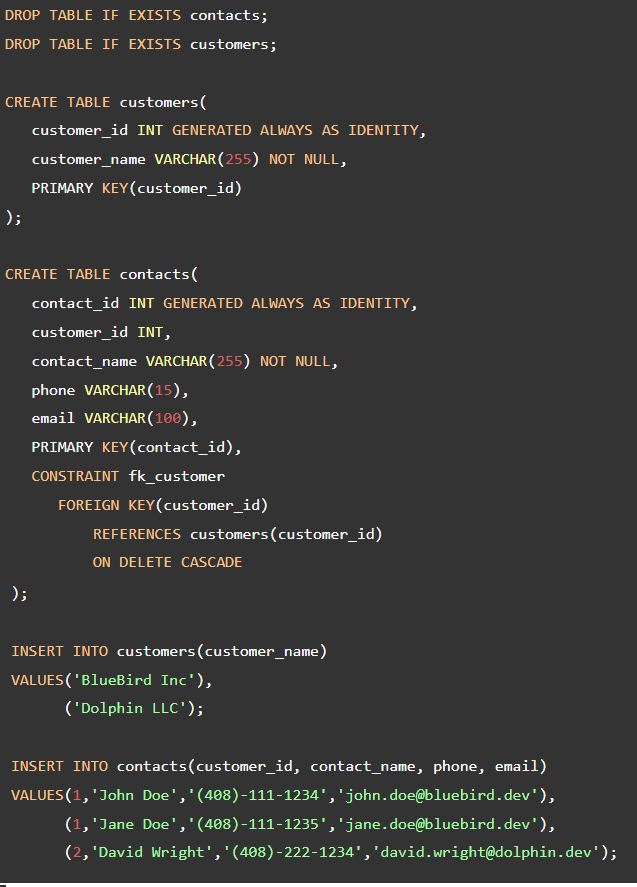

-   The following statement deletes the customer id 1:

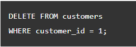

-   Because of the **ON DELETE CASCADE** action, all the referencing rows in the contacts table are automatically deleted:

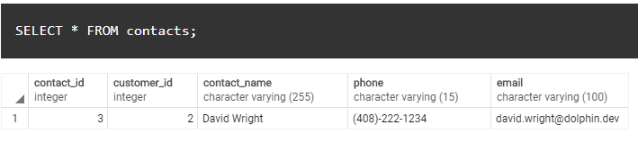

## 1.6 SET DEFAULT

-   The **ON DELETE SET DEFAULT** sets the default value to the foreign key column of the referencing rows in the child table when the referenced rows from the parent table are deleted.

## 2. Add a foreign key constraint to an existing table

-   To add a foreign key constraint to the existing table, you use the following form of the ALTER TABLE statement:

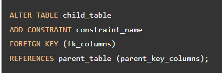

-   When you add a foreign key constraint with ON DELETE CASCADE option to an existing table, you need to follow these steps:

1\. First, drop existing foreign key constraints:

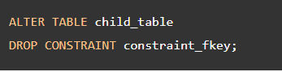

1.  Next, add a new foreign key constraint with ON DELETE CASCADE action:

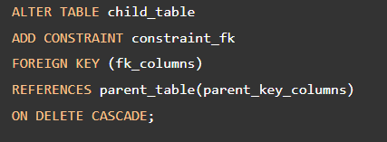

## 3. References

1.  https://www.postgresqltutorial.com/postgresql-tutorial/postgresql-foreign-key/
