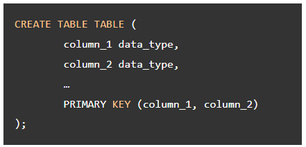
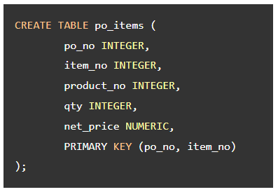
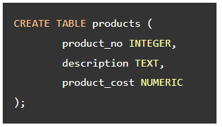
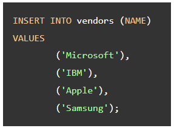
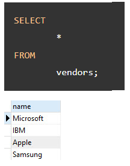
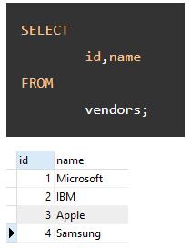

## Primary key Constraint

**Content**

**1. Primary key**

1.1 Define primary key when creating the table

1.2 Define primary key when changing the existing table structure

1.3 How to add an auto-incremented primary key to an existing table

1.4 Remove primary key

**2. References**

## 1. Primary key

-   A primary key is a column or a group of columns used to identify a row uniquely in a table.
-   Primary key constraint is the combination of a not-null constraint and a UNIQUE constraint.
-   A table can have one and only one primary key. It is a good practice to add a primary key to every table.

## 1.1 Define primary key when creating the table

-   Normally, we add the primary key to a table when we define the table’s structure using **CREATE TABLE** statement.

-   In case the primary key consists of two or more columns, you define the primary key constraint as follows:

**Example**

-   If you don’t specify explicitly the name for primary key constraint, PostgreSQL will assign a default name to the primary key constraint.
-   By default, PostgreSQL uses **table-name_pkey** as the default name for the primary key constraint.
-   In the above example, PostgreSQL creates the primary key constraint with the name **po_items_pkey** for the po_items table.

In case you want to specify the name of the primary key constraint, you use CONSTRAINT clause as follows:

## 1.2 Define primary key when changing the existing table structure

-   It is rare to define a primary key for existing table. In case you have to do it, you can use the **ALTER** **TABLE** statement to add a primary key constraint.

**Example**

-   Creates a table named **products** without defining any primary key.

-   Suppose you want to add a primary key constraint to the products table, you can execute the following statement:

## 1.3 How to add an auto-incremented primary key to an existing table

-   Suppose, we have a **vendors** table that does not have any primary key.

-   And we add few rows to the **vendors** table using **INSERT** statement:

-   To verify the insert operation, we query data from the vendors table using the following **SELECT** statement:

-   Now, if we want to add a primary key named **id** into the **vendors** table and the **id** field is auto-incremented by one, we use the following statement:

-   Let’s check the vendors table again.

## 1.4 Remove primary key

-   To remove an existing primary key constraint, you also use the **ALTER TABLE** statement with the following syntax:

-   For example, to remove the primary key constraint of the products table, you use the following statement:

## 2. References

-   https://www.postgresqltutorial.com/postgresql-tutorial/postgresql-primary-key/
