# PostgreSQL Subquery

**Content**

1\. PostgreSQL Subquery

2\. PostgreSQL subquery with IN operator

3\. PostgreSQL subquery with EXISTS Operator

4\. References

## 1. PostgreSQL Subquery

-   Let’s start with a simple example.
-   Suppose we want to find the films whose rental rate is higher than the average rental rate. We can do it in two steps:
1.  Find the average rental rate by using the SELECT statement and average function (AVG).
2.  Use the result of the first query in the second SELECT statement to find the films that we want.
-   The following query gets the average rental rate:

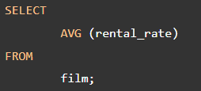

**Output**

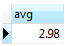

-   The average rental rate is 2.98
-   Now, we can get films whose rental rate is higher than the average rental rate:

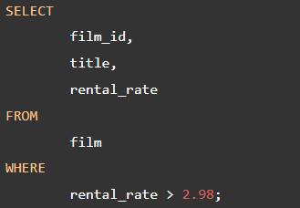

**Output**

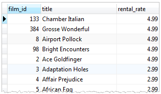

-   The code is not so elegant, which requires two steps. We want a way to pass the result of the first query to the second query in one query. The **solution** is to use a **subquery**.
-   A subquery is a **query nested inside another query** such as SELECT, INSERT, DELETE and UPDATE. In this document, we are focusing on the SELECT statement only.
-   To construct a subquery, we put the second query in brackets and use it in the WHERE clause as an expression:

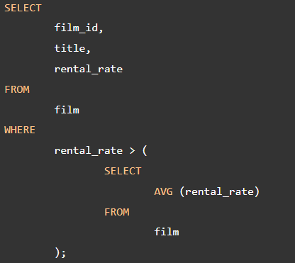

-   The query inside the brackets is called a **subquery** or an **inner query**.
-   The query that contains the **subquery** is known as an **outer query**.

**PostgreSQL executes the query that contains a subquery in the following sequence:**

-   First, executes the subquery.
-   Second, gets the result and passes it to the outer query.
-   Third, executes the outer query.

## 2. PostgreSQL subquery with IN operator

-   A subquery can return zero or more rows. To use this subquery, you use the [IN](https://www.postgresqltutorial.com/postgresql-tutorial/postgresql-in/) operator in the WHERE clause.
-   For example, to get films that have the returned date between 2005-05-29 and 2005-05-30, you use the following query:

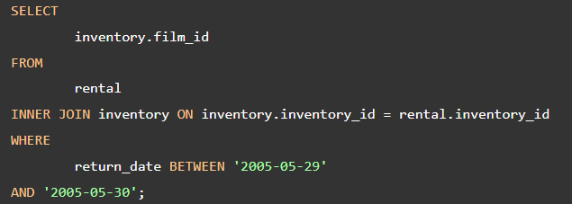

**Output**

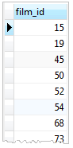

-   It returns multiple rows so we can use this query as a subquery in the WHERE clause of a query as follows:

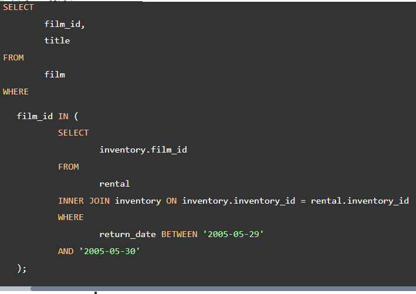

**Output**

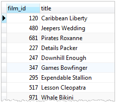

## 3. PostgreSQL subquery with EXISTS Operator

-   The following expression illustrates how to use a subquery with EXISTS operator:

-   A subquery can be an input of the EXISTS operator.
-   If the subquery returns any row, the EXISTS operator returns true.
-   If the subquery returns no row, the result of EXISTS operator is false.
-   The EXISTS operator only cares about the number of rows returned from the subquery, not the content of the rows.
-   The common coding convention of EXISTS operator is as follows:

-   See the following query:

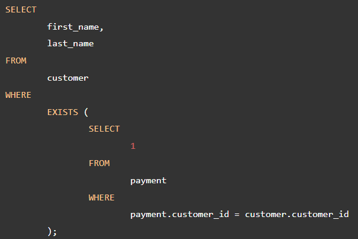

**Output**

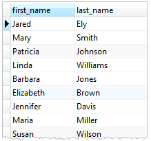

-   The query works like an inner join on the customer_id column.
-   However, it returns at most one row for each row in the customer table even though there are some corresponding rows in the payment table.

## 4. References

1.  https://www.postgresqltutorial.com/postgresql-tutorial/postgresql-subquery/
